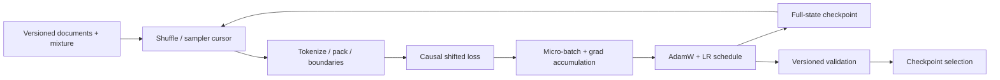

# nano-pretraining-loop L0 — 一条文档怎样变成可恢复的训练过程

> **核心问题**：从文档到 checkpoint，中间哪些状态共同定义“这是同一次训练”？
>
> **先修**：知道 next-token prediction、softmax/cross-entropy 和 Adam 的基本概念。
>
> **不变量**：document boundary、sample order、optimizer step、scheduler、data cursor 与模型权重必须共同版本化。
>
> **运行**：`python3 L0_pretraining_lifecycle.py`；纯标准库、CPU、固定输出。
>
> **验收**：12/12 self-check；完整状态 resume 与连续训练参数逐位一致，丢 Adam state 或 cursor 必须分叉；
> live iterator 不能直接序列化，但其 descriptor 能重建等价的下一步行为。
>
> **边界**：bigram LM 只隔离 lifecycle；没有 Transformer activation、GPU kernel、分布式通信或真实数据质量结论。

---

## 1. 为什么 02 轨不能只讲“怎样切模型”

FSDP、TP、PP、SP 回答的是模型、梯度、优化器和 activation **放在哪里**。即使这些都正确，训练仍可能因为
下列问题失去可比性：

- 文档边界被错误拼接成训练 target；
- resume 后数据从头读，某些样本重复、另一些永远没见；
- 只恢复权重，Adam moments 与 learning-rate step 被清零；
- global batch 或 gradient accumulation 改变，却继续沿用旧 scheduler；
- validation 数据、污染规则或 checkpoint selection 口径漂移。

所以完整 pretraining system 是一个状态机：



并行只是把这张图里的状态分布到更多设备上，不会替你补齐缺失的状态。

---

## 2. 先跑起来

```bash
python3 L0_pretraining_lifecycle.py
```

预期关键输出：

```text
[1] Document boundary + causal shift
    within-document (x_t -> x_t+1) pairs=9
    naive concatenation adds cross-document pairs=2

[3] Full-state checkpoint: uninterrupted == resume
    max parameter diff=0.000e+00

[4] Failure injection: weights-only is not exact resume
    reset Adam moments -> max parameter diff=...
    reset data cursor  -> max parameter diff=...

[5] Live object is not checkpoint state
    JSON(live iterator) -> REJECT
    descriptor(dataset_uri + cursor): consumed=10 restored_next=11

SELF-CHECK: 12/12 PASS
```

toy 的重点不是 loss 数值，而是三个反事实：完整状态续跑等于连续跑；少 optimizer state 不等；少 data cursor
也不等。它们共享同一份模型权重起点，因此分叉不能归咎于初始化。

---

## 3. 文档不是一条无限长字符串

对单个文档 $(t_0,t_1,\ldots,t_n)$，causal LM 的基本样本是：

$$
x=(t_0,\ldots,t_{n-1}),\qquad y=(t_1,\ldots,t_n).
$$

脚本对三个文档分别 shift，得到 9 个合法 pair。若先把文档直接拼成一长串再 shift，会额外出现两个“前一
文档 EOS → 下一文档 BOS”的 target。它们是否合理取决于明确的 packing policy：

- 有的系统允许跨文档 attention，并把 EOS 当正常分隔符；
- 有的系统 reset attention/position，禁止 token 看见前一文档；
- 有的系统允许 attention 但 mask 掉 boundary loss；
- packed sequence 还可能把多个短文档塞入固定长度 block，另存 segment IDs。

这里选择严格 document-local pairs 来展示边界。**重点不是“所有预训练都必须这么做”，而是边界策略必须被
记录，并由 attention mask、position IDs 和 labels 一致实现。** 只检查 tensor shape 无法发现语义串文档。

---

## 4. sample order 与 mixture 是训练目标的一部分

脚本把 `general` 文档权重设为 1，`domain` 权重设为 2，然后对每个 epoch 用
`Random(sampler_seed + epoch)` 确定性 shuffle。状态中保存：

```text
mixture + sampler_seed + sampler_epoch + sampler_cursor
```

这四项一起决定“下一条样本是什么”。真实系统还需固定数据 snapshot、shard list、过滤规则、tokenizer、
packing 实现、data parallel rank 与 worker count。只保存一个随机 seed 通常不够：worker 数或 sharding 方式改变，
同一个 seed 也可能产生不同全局顺序。

Mixture 不是 loader 的无害配置。重复 domain 文档改变了优化目标中的采样分布：

$$
\mathcal L(\theta)=\sum_d \alpha_d\,
\mathbb E_{x\sim D_d}\left[\ell_\theta(x)\right].
$$

因此 checkpoint manifest 应绑定 resolve 后的 $\alpha_d$ 和数据快照；CPT 中尤其要监控领域增益与通用能力遗忘。

---

## 5. gradient accumulation 改变“何时更新”，不是多写一层循环

脚本每个 optimizer step 读取两个 micro-batch，各 4 个 pair，先平均梯度再更新：

$$
g=\frac{1}{K}\sum_{k=1}^{K}g_k,\qquad K=2.
$$

如果 loss 已在 micro-batch 内求平均，再把 $K$ 个梯度直接相加而不除以 $K$，有效 learning rate 会扩大 $K$
倍。真实分布式训练的 global batch 通常是：

$$
B_{global}=B_{micro}\times K_{accum}\times N_{data\ parallel}.
$$

修改 DP world size、micro-batch 或 accumulation 都可能改变优化轨迹、warmup token 数和吞吐；“显存刚好放下”
不是完整配置。遇到 variable-length packing 时，还要决定按 sequence 还是有效 token 归一 loss。

---

## 6. AdamW 与 scheduler 为什么必须进入 checkpoint

模型参数只是优化器状态机的一部分。AdamW 更新依赖一阶、二阶矩和 step：

$$
m_t=\beta_1m_{t-1}+(1-\beta_1)g_t,
\quad
v_t=\beta_2v_{t-1}+(1-\beta_2)g_t^2.
$$

bias correction 又显式依赖 $t$。丢掉 $m_t,v_t,t$ 后，即使参数从同一个 checkpoint 开始，下一步也不是同一个
更新。learning-rate schedule 同样依赖 step 或 consumed tokens；恢复错一步会改变整段后续轨迹。

本 L0 checkpoint 保存：

```text
model + adam_m + adam_v + optimizer_step
sampler_seed + sampler_epoch + sampler_cursor + mixture
```

连续跑 20 步与“跑 8 步 → JSON serialize/deserialize → 跑到 20 步”最大参数差为 0。随后分别清空 Adam moments
或重置 cursor，参数都显著分叉。这证明的是**给定本 toy 与确定性实现的 exact resume**；真实 GPU 训练还受
非确定 kernel、collective 顺序、浮点规约、world-size 变化和 dataloader prefetch 影响，不应轻率承诺 bitwise equal。

---

## 7. 深刻理解“不可序列化对象”：保存重建配方，不保存正在发生的现场

序列化不是“把一个 Python 对象塞进文件”，而是把它变成一份**稳定、可移植、可解释的描述**，使另一个进程
能恢复我们关心的未来行为。设训练状态为 $Z_t$、下一批数据为 $B_t$：

$$
Z_{t+1}=T(Z_t,B_t).
$$

checkpoint 要保存的不是内存里每个对象的物理模样，而是足以让恢复进程得到等价 $Z_t$、取出同一个 $B_t$、
继续执行同一个 $T$ 的最小状态。

脚本的 `live_cursor_roundtrip()` 故意创建一个正在运行的 iterator。JSON 拒绝它，不是 JSON “功能太弱”，而是
iterator 的核心含义藏在解释器内部：它指向哪个容器、已经推进到哪里、容器是否会变化。把某个内存地址写进文件，
另一个进程也无法用这个地址继续 `next()`。

L0 改存：

```text
dataset_uri=toy://train-v1 + cursor=1
```

恢复时在 versioned registry 中重新打开相同数据，再 seek 到 cursor=1。原 live iterator 已消费 `10`，重建对象的
下一项是 `11`。二者不是同一个 Python identity，却在课程关心的观测上**行为等价**。

| live object | 为什么不能靠普通序列化恢复 | 应保存什么 |
|---|---|---|
| generator / iterator | instruction pointer、闭包、上游容器与 prefetch 状态隐含在进程里 | 数据快照、sampler seed/epoch/global cursor、worker/packing policy |
| file handle | fd 是当前进程的内核表索引；文件可能被替换 | URI/path、offset、mode、内容 digest；恢复时重新 open + seek |
| lock / condition | “谁持锁、谁在等待”属于并发现场 | durable lease/fencing epoch，或在安全点重建未持有锁 |
| socket / HTTP stream | 对端连接和 TCP 状态不在对象字段里 | request/idempotency key、receipt、协议状态；重连并 reconcile |
| CUDA context / stream / kernel | 绑定进程、设备、driver 与在途执行 | tensor/state_dict、device mapping、RNG；同步到安全点后重建 runtime |
| DataLoader workers | 子进程、队列、prefetch 中样本共同决定“下一批” | global sample IDs/cursor、worker/shard policy；恢复后验证 next-batch identity |

`pickle` 偶尔能 dump 某个自定义对象，也不能证明可移植恢复：它可能只保存 Python 实现细节，依赖同模块路径和代码，
更不可能复活 OS lock、远端 socket 或 in-flight GPU kernel。正确边界通常是：

```text
可序列化 state/data manifest
        +
显式 reconstruct() 过程
        +
恢复后的行为探针
```

行为探针至少检查 next sample IDs/masks、optimizer/RNG step 和若干更新，而不是只检查“对象 load 成功”。

---

## 8. validation 与 checkpoint selection 也要版本化

“保存最新 checkpoint”与“选择最好 checkpoint”是两个问题。最小记录至少包括：

```text
checkpoint_digest, parent_checkpoint, train_step, consumed_tokens
train_data_snapshot, validation_snapshot, metric_definition
model/optimizer/scheduler/RNG/sampler state, code/config digest
```

如果 validation 集或 metric 改了，旧分数与新分数不能直接排序；应产生新 evaluator version 并 re-baseline。
训练 loss 降低也不能证明通用能力、安全性或下游任务改善。对长训练建议同时保留 first、last、best、selected，
以及 loss spike 前的 rollback snapshot，而不是让一个 `best.pt` 文件名覆盖谱系。

---

## 9. 故障诊断顺序

出现 loss spike/NaN 时，先保留现场，再按因果半径排查：

1. 当前 batch/document IDs、token 长度、mask、domain mixture 是否异常；
2. loss scale、gradient norm、参数/激活 finite 检查；
3. learning rate、optimizer step、resume state 是否跳变；
4. 特定 rank/设备/collective 是否率先异常；
5. 从 spike 前 immutable checkpoint + 同一 data cursor 重放，能否复现；
6. 只有在证据支持时才跳过坏 batch，并记录 intervention，而不是静默继续。

“把 LR 调小再跑”可能让现象消失，却无法区分数据毒点、数值溢出、硬件错误或 resume 配置漂移。

---

## 10. 费曼自检

**类比**：模型权重像汽车所在的位置；optimizer moments 是速度与惯性；scheduler 是油门计划；data cursor 是
道路位置。只拍一张汽车照片再恢复，位置相同不代表下一秒运动相同。

思考题：

1. 为什么同一个 random seed 在 DP world size 改变后未必产生相同全局样本序列？
2. 把 gradient accumulation 从 8 改成 16 时，哪些量必须重新审视？
3. 为什么“resume 后 loss 接得上”仍不足以证明 exact resume？
4. validation 集换版后，为什么不能继续覆盖原来的 `best_score`？
5. packing 允许跨文档 attention 时，需要怎样记录 mask/position/boundary policy？
6. 为什么把 Python generator 用 `pickle` 成功写入文件（假设某实现碰巧支持）仍不足以证明 checkpoint 可恢复？
7. 一个 DataLoader 不保存 worker queue，怎样验证 descriptor 恢复到了等价位置？

<details>
<summary>参考答案</summary>

1. seed 只固定随机数源，DP sampler 还按 world size/rank 对全局序列切片。world size 改变会重排每个 rank 消费的样本与 batch 边界；若要语义连续，必须保存全局样本 identity/cursor 并定义重分片规则。
2. global batch、每 optimizer step 消费的 token 数、LR/weight-decay/clip 的 step 语义、scheduler 总步数、日志与 checkpoint cadence 都会变化。不能只把累积计数翻倍后沿用旧曲线。
3. 相邻两步 loss 接近可能只是数据容易或统计波动。判决性证据应包括下一批 sample IDs/mask、梯度或更新后参数 hash、optimizer step/moments、RNG 和多步 probe logits；这些共同证明续跑的是同一条轨迹。
4. `best_score` 只在固定数据快照、预处理、指标、解码和 evaluator 下可比。验证集换版等于换尺子，应开启新 namespace 并重建 baseline，旧记录保留用于 lineage。
5. manifest 至少记录文档 offset/segment、跨文档 attention mask、position reset、boundary token 是否计入 loss、packing 算法版本，以及 tokenizer/data snapshot。否则同一 token 序列可能代表不同监督问题。
6. “能 dump/load”只证明某种对象编码可执行，不证明数据源、代码、OS/GPU 资源和下一步行为相同。应明确目标观测，保存 portable descriptor，并在新进程验证下一批与若干状态转移。
7. 保存全局 sample identity/cursor、sampler epoch/seed、shard 与 worker/prefetch policy；恢复后先生成 next-batch manifest，与未中断运行的 sample IDs、document boundaries、mask 和 packing offsets 对比，再允许训练。

</details>

一句话验收：**FSDP/TP 决定状态放哪里；pretraining lifecycle 决定这些状态共同沿着哪一条可重放的训练轨迹前进。**
