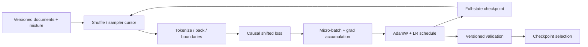

# nano-pretraining-loop L0 — 一条文档怎样变成可恢复的训练过程

> **核心问题**：从文档到 checkpoint，中间哪些状态共同定义“这是同一次训练”？
>
> **先修**：知道 next-token prediction、softmax/cross-entropy 和 Adam 的基本概念。
>
> **不变量**：document boundary、sample order、optimizer step、scheduler、data cursor 与模型权重必须共同版本化。
>
> **运行**：`python3 L0_pretraining_lifecycle.py`；纯标准库、CPU、固定输出。
>
> **验收**：10/10 self-check；完整状态 resume 与连续训练参数逐位一致，丢 Adam state 或 cursor 必须分叉。
>
> **边界**：bigram LM 只隔离 lifecycle；没有 Transformer activation、GPU kernel、分布式通信或真实数据质量结论。

---

## 1. 为什么 02 轨不能只讲“怎样切模型”

FSDP、TP、PP、SP 回答的是模型、梯度、优化器和 activation **放在哪里**。即使这些都正确，训练仍可能因为
下列问题失去可比性：

- 文档边界被错误拼接成训练 target；
- resume 后数据从头读，某些样本重复、另一些永远没见；
- 只恢复权重，Adam moments 与 learning-rate step 被清零；
- global batch 或 gradient accumulation 改变，却继续沿用旧 scheduler；
- validation 数据、污染规则或 checkpoint selection 口径漂移。

所以完整 pretraining system 是一个状态机：



并行只是把这张图里的状态分布到更多设备上，不会替你补齐缺失的状态。

---

## 2. 先跑起来

```bash
python3 L0_pretraining_lifecycle.py
```

预期关键输出：

```text
[1] Document boundary + causal shift
    within-document (x_t -> x_t+1) pairs=9
    naive concatenation adds cross-document pairs=2

[3] Full-state checkpoint: uninterrupted == resume
    max parameter diff=0.000e+00

[4] Failure injection: weights-only is not exact resume
    reset Adam moments -> max parameter diff=...
    reset data cursor  -> max parameter diff=...

SELF-CHECK: 10/10 PASS
```

toy 的重点不是 loss 数值，而是三个反事实：完整状态续跑等于连续跑；少 optimizer state 不等；少 data cursor
也不等。它们共享同一份模型权重起点，因此分叉不能归咎于初始化。

---

## 3. 文档不是一条无限长字符串

对单个文档 $(t_0,t_1,\ldots,t_n)$，causal LM 的基本样本是：

$$
x=(t_0,\ldots,t_{n-1}),\qquad y=(t_1,\ldots,t_n).
$$

脚本对三个文档分别 shift，得到 9 个合法 pair。若先把文档直接拼成一长串再 shift，会额外出现两个“前一
文档 EOS → 下一文档 BOS”的 target。它们是否合理取决于明确的 packing policy：

- 有的系统允许跨文档 attention，并把 EOS 当正常分隔符；
- 有的系统 reset attention/position，禁止 token 看见前一文档；
- 有的系统允许 attention 但 mask 掉 boundary loss；
- packed sequence 还可能把多个短文档塞入固定长度 block，另存 segment IDs。

这里选择严格 document-local pairs 来展示边界。**重点不是“所有预训练都必须这么做”，而是边界策略必须被
记录，并由 attention mask、position IDs 和 labels 一致实现。** 只检查 tensor shape 无法发现语义串文档。

---

## 4. sample order 与 mixture 是训练目标的一部分

脚本把 `general` 文档权重设为 1，`domain` 权重设为 2，然后对每个 epoch 用
`Random(sampler_seed + epoch)` 确定性 shuffle。状态中保存：

```text
mixture + sampler_seed + sampler_epoch + sampler_cursor
```

这四项一起决定“下一条样本是什么”。真实系统还需固定数据 snapshot、shard list、过滤规则、tokenizer、
packing 实现、data parallel rank 与 worker count。只保存一个随机 seed 通常不够：worker 数或 sharding 方式改变，
同一个 seed 也可能产生不同全局顺序。

Mixture 不是 loader 的无害配置。重复 domain 文档改变了优化目标中的采样分布：

$$
\mathcal L(\theta)=\sum_d \alpha_d\,
\mathbb E_{x\sim D_d}\left[\ell_\theta(x)\right].
$$

因此 checkpoint manifest 应绑定 resolve 后的 $\alpha_d$ 和数据快照；CPT 中尤其要监控领域增益与通用能力遗忘。

---

## 5. gradient accumulation 改变“何时更新”，不是多写一层循环

脚本每个 optimizer step 读取两个 micro-batch，各 4 个 pair，先平均梯度再更新：

$$
g=\frac{1}{K}\sum_{k=1}^{K}g_k,\qquad K=2.
$$

如果 loss 已在 micro-batch 内求平均，再把 $K$ 个梯度直接相加而不除以 $K$，有效 learning rate 会扩大 $K$
倍。真实分布式训练的 global batch 通常是：

$$
B_{global}=B_{micro}\times K_{accum}\times N_{data\ parallel}.
$$

修改 DP world size、micro-batch 或 accumulation 都可能改变优化轨迹、warmup token 数和吞吐；“显存刚好放下”
不是完整配置。遇到 variable-length packing 时，还要决定按 sequence 还是有效 token 归一 loss。

---

## 6. AdamW 与 scheduler 为什么必须进入 checkpoint

模型参数只是优化器状态机的一部分。AdamW 更新依赖一阶、二阶矩和 step：

$$
m_t=\beta_1m_{t-1}+(1-\beta_1)g_t,
\quad
v_t=\beta_2v_{t-1}+(1-\beta_2)g_t^2.
$$

bias correction 又显式依赖 $t$。丢掉 $m_t,v_t,t$ 后，即使参数从同一个 checkpoint 开始，下一步也不是同一个
更新。learning-rate schedule 同样依赖 step 或 consumed tokens；恢复错一步会改变整段后续轨迹。

本 L0 checkpoint 保存：

```text
model + adam_m + adam_v + optimizer_step
sampler_seed + sampler_epoch + sampler_cursor + mixture
```

连续跑 20 步与“跑 8 步 → JSON serialize/deserialize → 跑到 20 步”最大参数差为 0。随后分别清空 Adam moments
或重置 cursor，参数都显著分叉。这证明的是**给定本 toy 与确定性实现的 exact resume**；真实 GPU 训练还受
非确定 kernel、collective 顺序、浮点规约、world-size 变化和 dataloader prefetch 影响，不应轻率承诺 bitwise equal。

---

## 7. validation 与 checkpoint selection 也要版本化

“保存最新 checkpoint”与“选择最好 checkpoint”是两个问题。最小记录至少包括：

```text
checkpoint_digest, parent_checkpoint, train_step, consumed_tokens
train_data_snapshot, validation_snapshot, metric_definition
model/optimizer/scheduler/RNG/sampler state, code/config digest
```

如果 validation 集或 metric 改了，旧分数与新分数不能直接排序；应产生新 evaluator version 并 re-baseline。
训练 loss 降低也不能证明通用能力、安全性或下游任务改善。对长训练建议同时保留 first、last、best、selected，
以及 loss spike 前的 rollback snapshot，而不是让一个 `best.pt` 文件名覆盖谱系。

---

## 8. 故障诊断顺序

出现 loss spike/NaN 时，先保留现场，再按因果半径排查：

1. 当前 batch/document IDs、token 长度、mask、domain mixture 是否异常；
2. loss scale、gradient norm、参数/激活 finite 检查；
3. learning rate、optimizer step、resume state 是否跳变；
4. 特定 rank/设备/collective 是否率先异常；
5. 从 spike 前 immutable checkpoint + 同一 data cursor 重放，能否复现；
6. 只有在证据支持时才跳过坏 batch，并记录 intervention，而不是静默继续。

“把 LR 调小再跑”可能让现象消失，却无法区分数据毒点、数值溢出、硬件错误或 resume 配置漂移。

---

## 9. 费曼自检

**类比**：模型权重像汽车所在的位置；optimizer moments 是速度与惯性；scheduler 是油门计划；data cursor 是
道路位置。只拍一张汽车照片再恢复，位置相同不代表下一秒运动相同。

思考题：

1. 为什么同一个 random seed 在 DP world size 改变后未必产生相同全局样本序列？
2. 把 gradient accumulation 从 8 改成 16 时，哪些量必须重新审视？
3. 为什么“resume 后 loss 接得上”仍不足以证明 exact resume？
4. validation 集换版后，为什么不能继续覆盖原来的 `best_score`？
5. packing 允许跨文档 attention 时，需要怎样记录 mask/position/boundary policy？

一句话验收：**FSDP/TP 决定状态放哪里；pretraining lifecycle 决定这些状态共同沿着哪一条可重放的训练轨迹前进。**
