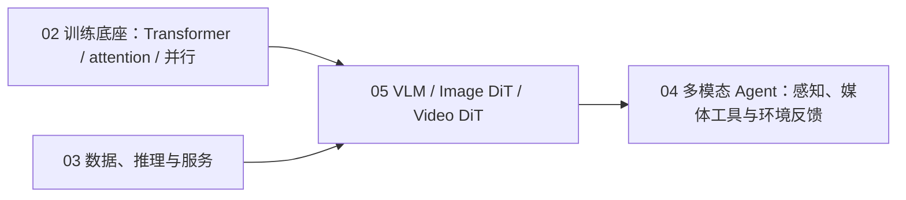

# 05 多模态理解与生成

> 主线：**LLM 图文理解 → DiT 文生图 → Video DiT 文生视频 → MiniMax H3 综合系统**。
> 这里不按厂商罗列模型，而是追踪 token、条件、流、时空序列和系统边界怎样逐层变化。

## 为什么单独成轨

语言模型的 token 是离散序列；图像先有二维网格，视频再增加时间轴，生成模型还必须从噪声沿连续流到媒体 latent。
如果把它们只当成“给 LLM 多传一个图片参数”，会漏掉四类核心问题：

1. 视觉证据怎样进入 LLM，模型究竟有没有依赖图像；
2. DiT 怎样在 latent token 上接入时间和文本条件；
3. 视频 token 为什么昂贵，逐帧正确为何仍会闪烁；
4. 单流 omni-modal 系统怎样同时打包、生成和解码视频/音频，又不越过开放组件与许可证边界。

原生音频只在 H3 综合案例中作为联合生成合同出现；本里程碑不另建音频轨。

## 一张图抓住本质

理解与生成可以先用一对相反的信息流统一理解；真正进入模型后，两者的训练目标、输入输出与评测仍然不同：

```text
理解：media --tokenize--> evidence tokens --condition question--> answer
生成：noise --predict conditional velocity repeatedly--> media latents --decode--> media
视频：在两条链上都再加入 time；token 更多，跨帧一致性也成为新的约束
H3：把 context / video / audio rows 打进同一序列，但按模态保留各自的输入输出头与 flow scheduler
```

- **VLM 的核心估计量**是 $p(y\mid x_{media},q)$；只测 $y$ 是否答对不够，还要换图或丢图，检查
  $p(y\mid x,q)$ 是否真的随视觉证据改变。答对、依赖图像、格式遵循和执行成功是四件事。
- **DiT 的核心对象**不是像素，而是条件向量场 $v_\theta(z_t,t,c)$。在约定的时间参数化下，采样是在 latent
  空间数值积分 $\mathrm dz/\mathrm dt=v_\theta$；符号、步长或 CFG 强度错了，即使网络结构正确也会沿错误轨迹走。
- **Video DiT 的新增困难**不是“多生成几张图”，而是 token 从 $HW$ 扩成 $THW$，并要求同一对象沿时间连续。
  若做 full attention，序列翻倍会让 attention pair 近似增至四倍；逐帧质量不能推出低 flicker。
- **Omni 模型的系统难点**是保持联合语义与模态合同同时成立：序列可以共享 attention，video/audio 的
  latent 率、row index、位置与 scheduler 却不能混用。

这四条是不随模型品牌变化的课程主干；Qwen3-VL、Qwen-Image、HunyuanVideo/Wan 与 H3 用来验证它们在真实实现里怎样落地。
如果还不确定 readout、三类 encoder/VAE、参数口径和现代多阶段训练分别指什么，先读
[《多模态模型解剖与训练》](MODEL_ANATOMY_AND_TRAINING.md)，再进入四个实验模块。

## 当前模型名怎样读

截至 2026-09-14，课程不再把“发布日期最新”直接写成“最适合实验”或“SOTA”：

| 方向 | 当前前沿追踪 | 本课程可复现锚 | 为什么不强行统一 |
|---|---|---|---|
| 图文/视频理解 | Qwen3.8-Flash-Next、Qwen3.5-Omni、InternVL3.5 / InternVL-U | Qwen3-VL-2B-Instruct | 新模型可能更大、仅托管或属于不同任务族；2B 锚已有固定 revision 和失败样例 |
| 文生图/编辑 | Qwen-Image-2.0、InternVL-U | Qwen-Image-2512 | 2.0 更新，但官方开放仓库当前可下载 T2I 基线仍是 2512 |
| 文生视频 | MiniMax H3、Wan2.2、HunyuanVideo-1.5 | Wan2.2 / HunyuanVideo-1.5；H3 分批 gate | H3 是原生视听生成系统，不能与纯 T2V 模型只按一个总分排序 |

这里的“前沿”只表示应该持续跟踪的公开模型，不等于跨任务全局第一。模型身份、开放层级与一手来源见
[证据账本](RESEARCH.md)；实验时仍须固定 checkpoint 和代码 revision。

## 为什么按 L0 → L3，而不是直接下载最大模型

| 级别 | 新增的真实约束 | 本级应回答 | 暂时不能回答 | ROI gate |
|---|---|---|---|---|
| L0 机制 | 最小状态、显式 oracle/手工 readout | 数据流、不变量和错误注入是否成立 | 训练后能力、自然媒体质量 | 分钟级 CPU；反例不能稳定触发就不升 L1 |
| L1 小模型 | 真实 tensor、优化或真实小权重 | 机制进入学习系统后是否仍可测、失败归因是否清楚 | 大模型质量、生产吞吐 | 单卡小时内；先闭合 correctness/completion 再扩样本 |
| L2 开放系统 | 真实 processor、VAE、offload/batching 与固定 revision | token/显存/延迟账和质量 rubric 是否可复现 | 托管私有模块、跨集群 SLA | 只在 L1 暴露的瓶颈值得放大时下载重权重 |
| L3 综合 | 多模态合同、部署边界、人工与代理评测 | 组件组合后是否仍可审计，能力—成本—许可证是否同表 | “一次 smoke 即生产可用” | 先过许可证/磁盘/GPU go-no-go，再做最小案例 |

因此，本轨的前沿性来自“经典机制 + 当前开放实现 + 可证伪边界”，不是模型名密度；ROI 来自先用低成本实验排除
方向、条件、token 账或评测构念错误，再支付大权重和人工盲评成本。

## 先修关系



- 从 02 带入 Transformer、position encoding、训练/显存账；本轨增加 visual/latent/spatiotemporal token。
- 从 03 带入数据 provenance、batching、offload 与服务评测；本轨增加媒体数据和生成服务。
- 学完 05 再回到 04，才能判断 Agent 收到的是可靠视觉证据、生成代理，还是不可审计的媒体副作用。

## 四模块学习顺序

| 顺序 | 模块 | L0 当前回答的问题 | 当前状态 |
|---|---|---|---|
| 1 | [nano-vlm-understanding](nano-vlm-understanding/) | patch、projector、2D position 与图像依赖反事实 | L0–L1 完成；L1 已有单张 L20 双进程证据 |
| 2 | [nano-image-dit](nano-image-dit/) | latent patch、AdaLN、rectified flow、Euler 与 CFG | L0 完成 |
| 3 | [nano-video-dit](nano-video-dit/) | 3D token、端点条件、时序耦合、flicker 与 $N^2$ 成本 | L0 完成 |
| 4 | [minimax-h3-capstone](minimax-h3-capstone/) | packed omni sequence、视频/音频双 flow 与本地/托管边界 | L0 完成 |

完整论文、模型卡、配置、源码和开放缺口见 [RESEARCH.md](RESEARCH.md)；概念、参数与训练路线见
[MODEL_ANATOMY_AND_TRAINING.md](MODEL_ANATOMY_AND_TRAINING.md)。

## L0：纯标准库机制闭环

四个脚本都满足：单文件、不超过 200 行、Python 3.10+、CPU、无网络和模型下载，末行输出稳定
`RESULT_JSON=`。建议依次运行：

```bash
python3 -B nano-vlm-understanding/L0_visual_tokens_to_language.py
python3 -B nano-image-dit/L0_rectified_flow_dit_oracle.py
python3 -B nano-video-dit/L0_spatiotemporal_latent_dit.py
python3 -B minimax-h3-capstone/L0_h3_system_contract.py
```

L0 的共同验收不是“看起来像”，而是固定反例和量化不变量：

| 模块 | 正向量 | 必须失败的反例 | 证据边界 |
|---|---|---|---|
| VLM | 分技能 EM、图像依赖增益、swap sensitivity | drop/swap/shuffle/remove-2D-position | 固定 readout，不是训练 VLM |
| Image DiT | latent MAE、条件命中、token 比 | wrong sign、CFG 过冲 | oracle velocity，不是学会生成 |
| Video DiT | 端点误差、roughness、flicker、attention pairs | 逐帧抖动 | 线性 latent toy，不是视频质量 |
| H3 | packed token、双 scheduler、单次 forward | row/tag/scheduler/deployment 错误 | surrogate contract，不是官方 IR/权重运行 |

## L1：真实小模型

- **VLM**：Qwen3-VL-2B-Instruct 小样本推理；固定 OCR、空间关系、计数、image-swap 和证据不足拒答集；
  分开报告 normalized semantic accuracy、strict-format accuracy、swap sensitivity/correctness、completion 与重复稳定性。
- **Image DiT**：PyTorch CPU/GPU 训练微型 rectified-flow DiT。公开真实样本与合成条件分别报告，合成集不代表真实质量。
- **Video DiT**：moving-digit 小视频训练时空 DiT；验证运动条件、首尾帧和 held-out temporal consistency。
- **H3**：只下载公开 config/tokenizer metadata，复算结构、序列和显存账，不下载大权重。

VLM L1 已于 2026-09-04 闭环：固定 Qwen3-VL-2B-Instruct revision，两个独立离线进程各重复两轮；均为 8/8
系统 checks，稳定 digest `5ee6a7c212010936`，峰值 allocated VRAM 4.044 GiB。六例中 OCR 漏掉数字，故语义和
严格格式准确率均为 0.833；image-swap 的 sensitivity 与 correctness 均为真。详见
[L1 教程](nano-vlm-understanding/tutorial_L1.md)。这是固定 synthetic diagnostics 的实现证据，不是自然图像 benchmark。

## L2：真实开放系统

- **VLM**：以 Qwen3-VL 做动态分辨率、visual token budget、DeepStack、interleaved MRoPE、batching 与 connector/LoRA
  小实验；Qwen3.8-Flash-Next 先做 metadata/资源 gate，不因发布时间更新就替换既有 2B 对照。
- **Image DiT**：以 Qwen-Image-2512 做真实生成，检查文字、空间、组合、延迟和显存；vendor leaderboard 仅作外部声明。
- **Video DiT**：HunyuanVideo 1.5 / Wan2.2 的 3D VAE、DiT、offload、tiling、稀疏/序列并行与固定提示集实证。
- **统一评测**：CLIP/VLM judge 等自动分只作代理，必须与盲评 rubric 分栏，不让单一 judge 证明视觉质量。

## L3：H3 真机综合

执行前重新只读确认 GPU、磁盘、依赖和许可证，固定 H3、SGLang/Diffusers 与模型 revision。首批只下载 FL2VA，
在通过前置 gate 的 GPU 机器上跑 BF16、短边 768p、24 FPS、4 秒三个最小案例：直接 T2VA、同 seed 本地结构化 prompt T2VA、
首尾帧 FL2VA。

不调用付费 Context-IR/2K API，不声称本地复现 2K 完整系统；Ref2VA 大权重与第二 checkpoint 另批批准。每次记录
prompt、seed、revision、GPU、耗时、峰值显存、输出 SHA256、视频时长/FPS 和 32 kHz stereo 音频契约；媒体存仓库外。
评测把指令/镜头遵循、首尾帧约束、时序稳定、视觉事件—音频能量峰值对齐的代理量与人工判断分栏。

## 完成标志

学习者应能：

1. 画出 visual token 到 LLM、latent token 到 DiT、spatiotemporal token 到 Video DiT 的三条数据流；
2. 用反事实区分“答对”与“依赖图像”，用时序指标区分“逐帧好看”与“视频一致”；
3. 写出 rectified-flow 目标和 CFG，识别 scheduler 方向/强度错误；
4. 对 H3 分开陈述官方公开事实、源码实现、课程 surrogate、托管模块与许可证限制；
5. 明确 toy、开放权重、代理指标和一次真机 smoke 各自不能证明什么。
