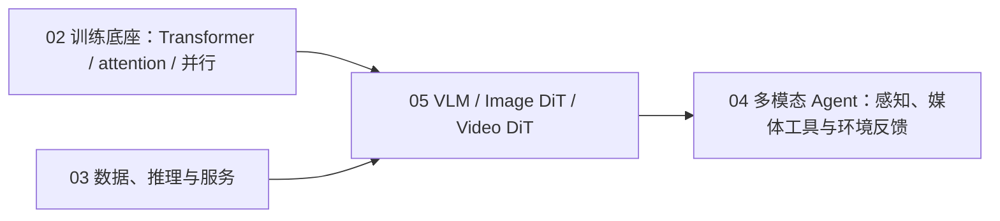

# 05 多模态理解与生成

> 主线：**LLM 图文理解 → DiT 文生图 → Video DiT 文生视频 → MiniMax H3 综合系统**。
> 这里不按厂商罗列模型，而是追踪 token、条件、流、时空序列和系统边界怎样逐层变化。

## 为什么单独成轨

语言模型的 token 是离散序列；图像先有二维网格，视频再增加时间轴，生成模型还必须从噪声沿连续流到媒体 latent。
如果把它们只当成“给 LLM 多传一个图片参数”，会漏掉四类核心问题：

1. 视觉证据怎样进入 LLM，模型究竟有没有依赖图像；
2. DiT 怎样在 latent token 上接入时间和文本条件；
3. 视频 token 为什么昂贵，逐帧正确为何仍会闪烁；
4. 单流 omni-modal 系统怎样同时打包、生成和解码视频/音频，又不越过开放组件与许可证边界。

原生音频只在 H3 综合案例中作为联合生成合同出现；本里程碑不另建音频轨。

## 先修关系



- 从 02 带入 Transformer、position encoding、训练/显存账；本轨增加 visual/latent/spatiotemporal token。
- 从 03 带入数据 provenance、batching、offload 与服务评测；本轨增加媒体数据和生成服务。
- 学完 05 再回到 04，才能判断 Agent 收到的是可靠视觉证据、生成代理，还是不可审计的媒体副作用。

## 四模块学习顺序

| 顺序 | 模块 | L0 当前回答的问题 | 当前状态 |
|---|---|---|---|
| 1 | [nano-vlm-understanding](nano-vlm-understanding/) | patch、projector、2D position 与图像依赖反事实 | L0 完成 |
| 2 | [nano-image-dit](nano-image-dit/) | latent patch、AdaLN、rectified flow、Euler 与 CFG | L0 完成 |
| 3 | [nano-video-dit](nano-video-dit/) | 3D token、端点条件、时序耦合、flicker 与 $N^2$ 成本 | L0 完成 |
| 4 | [minimax-h3-capstone](minimax-h3-capstone/) | packed omni sequence、视频/音频双 flow 与本地/托管边界 | L0 完成 |

完整论文、模型卡、配置、源码和开放缺口见 [RESEARCH.md](RESEARCH.md)。

## L0：纯标准库机制闭环

四个脚本都满足：单文件、不超过 200 行、Python 3.10+、CPU、无网络和模型下载，末行输出稳定
`RESULT_JSON=`。建议依次运行：

```bash
python3 -B nano-vlm-understanding/L0_visual_tokens_to_language.py
python3 -B nano-image-dit/L0_rectified_flow_dit_oracle.py
python3 -B nano-video-dit/L0_spatiotemporal_latent_dit.py
python3 -B minimax-h3-capstone/L0_h3_system_contract.py
```

L0 的共同验收不是“看起来像”，而是固定反例和量化不变量：

| 模块 | 正向量 | 必须失败的反例 | 证据边界 |
|---|---|---|---|
| VLM | 分技能 EM、图像依赖增益、swap sensitivity | drop/swap/shuffle/remove-2D-position | 固定 readout，不是训练 VLM |
| Image DiT | latent MAE、条件命中、token 比 | wrong sign、CFG 过冲 | oracle velocity，不是学会生成 |
| Video DiT | 端点误差、roughness、flicker、attention pairs | 逐帧抖动 | 线性 latent toy，不是视频质量 |
| H3 | packed token、双 scheduler、单次 forward | row/tag/scheduler/deployment 错误 | surrogate contract，不是官方 IR/权重运行 |

## L1：真实小模型

- **VLM**：Qwen3-VL-2B-Instruct 小样本推理；固定 OCR、空间关系、计数、image-swap 和证据不足拒答集。
- **Image DiT**：PyTorch CPU/GPU 训练微型 rectified-flow DiT。公开真实样本与合成条件分别报告，合成集不代表真实质量。
- **Video DiT**：moving-digit 小视频训练时空 DiT；验证运动条件、首尾帧和 held-out temporal consistency。
- **H3**：只下载公开 config/tokenizer metadata，复算结构、序列和显存账，不下载大权重。

## L2：真实开放系统

- **VLM**：Qwen3-VL 动态分辨率、visual token budget、DeepStack、interleaved MRoPE、batching 与 connector/LoRA 小实验。
- **Image DiT**：以 Qwen-Image-2512 做真实生成，检查文字、空间、组合、延迟和显存；vendor leaderboard 仅作外部声明。
- **Video DiT**：HunyuanVideo 1.5 / Wan2.2 的 3D VAE、DiT、offload、tiling、稀疏/序列并行与固定提示集实证。
- **统一评测**：CLIP/VLM judge 等自动分只作代理，必须与盲评 rubric 分栏，不让单一 judge 证明视觉质量。

## L3：H3 真机综合

执行前重新只读确认 GPU、磁盘、依赖和许可证，固定 H3、SGLang/Diffusers 与模型 revision。首批只下载 FL2VA，
在可用 H20 机器上跑 BF16、短边 768p、24 FPS、4 秒三个最小案例：直接 T2VA、同 seed 本地结构化 prompt T2VA、
首尾帧 FL2VA。

不调用付费 Context-IR/2K API，不声称本地复现 2K 完整系统；Ref2VA 大权重与第二 checkpoint 另批批准。每次记录
prompt、seed、revision、GPU、耗时、峰值显存、输出 SHA256、视频时长/FPS 和 32 kHz stereo 音频契约；媒体存仓库外。
评测把指令/镜头遵循、首尾帧约束、时序稳定、视觉事件—音频能量峰值对齐的代理量与人工判断分栏。

## 完成标志

学习者应能：

1. 画出 visual token 到 LLM、latent token 到 DiT、spatiotemporal token 到 Video DiT 的三条数据流；
2. 用反事实区分“答对”与“依赖图像”，用时序指标区分“逐帧好看”与“视频一致”；
3. 写出 rectified-flow 目标和 CFG，识别 scheduler 方向/强度错误；
4. 对 H3 分开陈述官方公开事实、源码实现、课程 surrogate、托管模块与许可证限制；
5. 明确 toy、开放权重、代理指标和一次真机 smoke 各自不能证明什么。
