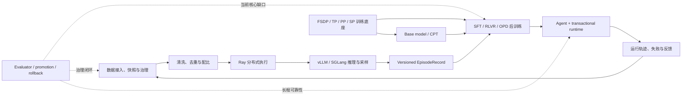

# LLM-PBL 学习总导航

> 这里是 `tutorial/material` 的统一入口。单篇教程回答“这个机制怎样跑起来”；
> 本页回答“为什么先学它、下一篇读什么、同一个机制在别的轨道怎样复用”。
>
> 内容快照：2026-08-14。模块仍在持续演进；**是否已有某一级，
> 以对应模块 README 的阶梯表为准**，不要仅凭轨道 README 中的概览判断。

---

## 先建立一张系统图

四条轨道不是四门互不相干的课，而是一条有反馈的系统链：

图里的实线已有较强的可运行材料。虚线的 **evaluator / promotion / rollback** 已有一个跨轨
[Capability Factory L0](cross-track-capability-factory/tutorial_L0.md) 把 multi-teacher OPD、
candidate-parent gate、lineage 和 rollback 接成最小闭环，但真实模型、隐藏评估与 evaluator succession
仍待 L1–L3。不要把“数据能回流”或“toy gate 跑通”误读成“系统已经证明会持续自我改进”。
详细审计见 [CURRICULUM-AUDIT.md](CURRICULUM-AUDIT.md)。

---

## 四条轨道：各自解决什么根问题

| 轨道 | 根问题 | 当前最强覆盖 | 进入 |
|------|--------|--------------|------|
| 01 后训练 / RL / SFT | 如何把 base model 变成可用策略，并让采样、奖励与更新形成闭环？ | SFT、PPO/GRPO、reward failure、OPD，以及跨轨 EpisodeRecord 合同 | [进入轨道 01](01-post-training-rl-sft/README.md) |
| 02 预训练 / CPT | 从文档到可恢复 checkpoint 的完整训练过程怎样建立，并在模型放不下一张卡时正确切分？ | pretraining lifecycle L0、ZeRO/FSDP、TP/PP/SP、MoE/MLA | [进入轨道 02](02-pretraining-cpt/README.md) |
| 03 数据 / 分布式 / RSI | 怎样把原始数据变成可复现、可扩展、可评估的训练与检索供给？ | OP pipeline、Ray task/actor/object store、KV/page/radix、湖仓/DAG/RAG L0 | [进入轨道 03](03-data-distributed-rsi/README.md) |
| 04 LLM → Agent | 怎样把随机、会失败的模型包成可观察、可约束、可恢复的执行体？ | ReAct、typed messages、上下文记忆、harness，以及事务化副作用 L0 | [进入轨道 04](04-llm-to-agent/README.md) |

“当前最强覆盖”描述的是已经写出来的材料，不等于整条学科已经覆盖完整。

---

## 按目标选路线

### 路线 A：最短机制主干

适合第一次建立全栈心智模型。每篇都先跑代码，再读解释。

1. [SFT 的 template / mask / collator](01-post-training-rl-sft/nano-llamafactory/tutorial_L0.md)
2. [REINFORCE 与 rollout/train 调度](01-post-training-rl-sft/nano-verl/tutorial_L0.md)
3. [文档到完整 checkpoint 的 pretraining lifecycle](02-pretraining-cpt/nano-pretraining-loop/tutorial_L0.md)
4. [ZeRO 显存账本](02-pretraining-cpt/nano-fsdp/tutorial_L0.md)
5. [TP 的切分与通信](02-pretraining-cpt/nano-megatron/tutorial_L0.md)
6. [OP 抽象与配置驱动数据管线](03-data-distributed-rsi/nano-data-juicer/tutorial_L0.md)
7. [KV cache、continuous batching 与分页](03-data-distributed-rsi/nano-vllm-sglang/tutorial_L0.md)
8. [ReAct 单 agent 闭环](04-llm-to-agent/nano-agentscope/tutorial_L0.md)
9. [事务化副作用与崩溃恢复](04-llm-to-agent/nano-agent-runtime/tutorial_L0.md)

完成后应能画出“数据 → 训练 → 采样 → agent → 轨迹回流”的整张图，并指出每个箭头的
状态、成本、证据与失败模式分别住在哪里。

### 路线 B：训练与推理系统

适合已有算法基础、重点补 infra 的读者：

1. [nano-pretraining-loop L0](02-pretraining-cpt/nano-pretraining-loop/tutorial_L0.md)：数据顺序、优化器与完整 resume；
2. [nano-fsdp](02-pretraining-cpt/nano-fsdp/) L0→L3：参数、梯度、优化器与 activation 的显存账；
3. [nano-megatron](02-pretraining-cpt/nano-megatron/) L0→L3：TP→PP→SP 与 MFU；
4. [nano-vllm-sglang](03-data-distributed-rsi/nano-vllm-sglang/) L0→L3：KV→page→radix；
5. [nano-verl](01-post-training-rl-sft/nano-verl/) L1→L3：PPO 数据流→角色隔离→colocate；
6. [nano-slime](01-post-training-rl-sft/nano-slime/) L0→L1：解耦、版本与 staleness。

这条路线的统一问题不是“用了哪个框架”，而是：**状态放在哪里、何时搬运、谁在关键路径、
搬运后语义是否仍与原计算一致。**

### 路线 C：数据—模型—Agent 飞轮

1. [nano-data-platform L0](03-data-distributed-rsi/nano-data-platform/tutorial_L0.md)：raw/curated、快照与 lineage；
2. [nano-data-juicer](03-data-distributed-rsi/nano-data-juicer/) L0→L3：数据算子与分布式语义；
3. [nano-ray](03-data-distributed-rsi/nano-ray/) L0→L3：执行、共享状态与 object store；
4. [数据方法论 deep-dive](03-data-distributed-rsi/sota-deepdive/data-methodology.md)：去重、质量、配比、去污染；
5. [reward signals 与 Goodhart](01-post-training-rl-sft/nano-trinity-rft/tutorial_L2.md)：反馈不等于真目标；
6. [harness engineering](04-llm-to-agent/sota-deepdive/harness-engineering.md)：让失败可发现、状态可续接；
7. 回到 [课程审计的 RSI 缺口](CURRICULUM-AUDIT.md#p1-1-把数据飞轮补成受治理的-rsi-闭环)，设计 promotion gate。

这条路线的验收不是“成功训练过一次”，而是能回答：候选是否真的优于 parent、谁批准晋升、
评估器有没有漂移、失败怎样回滚、何时应该停止。

### 路线 D：能力工厂与受治理集成

适合已经理解单项训练算法，希望把四轨闭成一个研发系统的读者：

1. [nano-opd L0](01-post-training-rl-sft/nano-opd/tutorial_L0.md)：为什么 reverse-KL 要在学生轨迹上估计；
2. [EpisodeRecord L0](cross-track-episode-record/tutorial_L0.md)：先固定 rollout 的 provenance、termination 和版本合同；
3. [EpisodeRecord L1](cross-track-episode-record/tutorial_L1.md)：再把可变长 record 变成 PPO/GRPO/OPD tensor view；
4. [后训练算法演进 §6](01-post-training-rl-sft/sota-deepdive/post-training-algorithm-evolution.md#6-opd蒸馏与-rl-的合流点)：OPD 的生产定位；
5. [Capability Factory L0](cross-track-capability-factory/tutorial_L0.md)：full-vocabulary / sampled-token
   两种估计器、teacher routing、能力保留向量与 promotion gate；
6. [事务化 Agent runtime L0](04-llm-to-agent/nano-agent-runtime/tutorial_L0.md)：让副作用可授权、幂等和恢复；
7. [课程审计的跨轨毕业项目](CURRICULUM-AUDIT.md#建议的跨轨毕业项目)：把 toy 升成真实受治理闭环。

完成后应能区分：能力生产可以并行、能力表示仍会纠缠、集成完成不等于 candidate 应当晋升。

---

## 按核心概念交叉阅读

| 核心概念 | 第一锚点 | 系统化 / 反例 | 迁移任务 |
|----------|----------|---------------|----------|
| 训练/轨迹数据合同 | [SFT mask](01-post-training-rl-sft/nano-llamafactory/tutorial_L0.md) | [EpisodeRecord record→tensor](cross-track-episode-record/tutorial_L1.md) · [Data-Juicer OP schema](03-data-distributed-rsi/nano-data-juicer/tutorial_L3.md) · [Agent typed message](04-llm-to-agent/nano-agentscope/tutorial_L3.md) | 为一条轨迹绑定 storage schema、training fields、termination 与版本身份，并区分 episode-mean 与 token-mean |
| advantage / reward | [REINFORCE](01-post-training-rl-sft/nano-verl/tutorial_L0.md) | [PPO + GAE](01-post-training-rl-sft/nano-verl/tutorial_L1.md) · [dead group / Goodhart](01-post-training-rl-sft/nano-trinity-rft/tutorial_L2.md) | 区分 reward、value、advantage、gold metric 四个量 |
| policy version / staleness | [actor-learner split](01-post-training-rl-sft/nano-verl/tutorial_L2.md) | [slime buffer](01-post-training-rl-sft/nano-slime/tutorial_L0.md) · [HybridFlow colocate](01-post-training-rl-sft/nano-verl/tutorial_L3.md) | 给 trajectory 加 `policy_version`，定义最大可接受滞后与丢弃策略 |
| 显存与吞吐 | [ZeRO 账本](02-pretraining-cpt/nano-fsdp/tutorial_L0.md) | [TP/PP/SP](02-pretraining-cpt/nano-megatron/) · [paged/radix KV](03-data-distributed-rsi/nano-vllm-sglang/) | 分开算训练状态、activation、KV cache 与通信峰值 |
| 状态、血缘与恢复 | [lakehouse snapshot](03-data-distributed-rsi/nano-data-platform/tutorial_L0.md) | [pretraining exact resume](02-pretraining-cpt/nano-pretraining-loop/tutorial_L0.md) · [EpisodeRecord batch round-trip](cross-track-episode-record/tutorial_L1.md) · [transaction runtime](04-llm-to-agent/nano-agent-runtime/tutorial_L0.md) | 分别恢复训练状态、轨迹事实、派生 batch 与外部副作用，说明 round-trip 为何不等于 exactly-once admission |
| 评估与治理 | [RAG metrics](03-data-distributed-rsi/nano-rag-retrieval/tutorial_L0.md) | [reward proxy 失效](01-post-training-rl-sft/nano-trinity-rft/tutorial_L2.md) · [Capability Factory gate](cross-track-capability-factory/tutorial_L0.md) · [对抗自检](04-llm-to-agent/nano-qwenpaw/tutorial_L2.md) | 做 candidate-parent 配对评估，加入隐藏 sentinel、回滚与停止条件 |
| 多教师能力集成 | [nano-opd](01-post-training-rl-sft/nano-opd/) | [Capability Factory](cross-track-capability-factory/) · [FSDP/TP 系统代价](02-pretraining-cpt/) | 比较 full-vocabulary 与 sampled-token OPD，注入错路由并检查最坏领域回归 |
| 配置是可执行契约 | [pipeline config](03-data-distributed-rsi/nano-data-juicer/tutorial_L0.md) | [Trinity schema / registry](01-post-training-rl-sft/nano-trinity-rft/tutorial_L3.md) | 让非法组合在运行前失败，并记录 resolve 后的最终配置 |

---

## 当前可读阶梯

下表按磁盘上实际存在的教程列出；空缺是课程空缺，不代表对应框架没有该能力。

| 轨道 | 模块 | 已有教程 |
|------|------|----------|
| 01 | [nano-llamafactory](01-post-training-rl-sft/nano-llamafactory/) | L0 · L1 · L2 |
| 01 | [nano-verl](01-post-training-rl-sft/nano-verl/) | L0 · L1 · L2 · L3 |
| 01 | [nano-slime](01-post-training-rl-sft/nano-slime/) | L0 · L1 |
| 01 | [nano-trinity-rft](01-post-training-rl-sft/nano-trinity-rft/) | L0 · L1 · L2 · L3 |
| 01 | [nano-opd](01-post-training-rl-sft/nano-opd/) | L0 · L1 |
| 跨轨 | [Capability Factory](cross-track-capability-factory/) | L0 |
| 跨轨 | [EpisodeRecord](cross-track-episode-record/) | L0 · L1 |
| 02 | [nano-pretraining-loop](02-pretraining-cpt/nano-pretraining-loop/) | L0 |
| 02 | [nano-fsdp](02-pretraining-cpt/nano-fsdp/) | L0 · L1 · L2 · L3 |
| 02 | [nano-megatron](02-pretraining-cpt/nano-megatron/) | L0 · L1 · L2 · L3 |
| 03 | [nano-data-juicer](03-data-distributed-rsi/nano-data-juicer/) | L0 · L1 · L2 · L3 |
| 03 | [nano-ray](03-data-distributed-rsi/nano-ray/) | L0 · L1 · L2 · L3 |
| 03 | [nano-vllm-sglang](03-data-distributed-rsi/nano-vllm-sglang/) | L0 · L1 · L2 · L3 |
| 03 | [nano-data-platform](03-data-distributed-rsi/nano-data-platform/) | L0 |
| 03 | [nano-data-orchestration](03-data-distributed-rsi/nano-data-orchestration/) | L0 |
| 03 | [nano-rag-retrieval](03-data-distributed-rsi/nano-rag-retrieval/) | L0 |
| 04 | [nano-agentscope](04-llm-to-agent/nano-agentscope/) | L0 · L1 · L2 · L3 |
| 04 | [nano-qwenpaw](04-llm-to-agent/nano-qwenpaw/) | L0 · L1 · L2 · L3 |
| 04 | [nano-agent-runtime](04-llm-to-agent/nano-agent-runtime/) | L0 |

四篇综合 deep-dive：

- [后训练算法演进](01-post-training-rl-sft/sota-deepdive/post-training-algorithm-evolution.md)
- [DeepSeek-V3：MoE / MLA / FP8 / 稳定性](02-pretraining-cpt/sota-deepdive/deepseek-moe-mla-stability.md)
- [LLM 数据方法论](03-data-distributed-rsi/sota-deepdive/data-methodology.md)
- [Harness Engineering](04-llm-to-agent/sota-deepdive/harness-engineering.md)

---

## 一篇教程怎样才算学完

不要把“读完”当成验收。每篇至少完成下面六步：

1. **先预测**：运行前写下你预计变化的量、方向和不变量。
2. **原样运行**：确认依赖、命令、退出码与 self-check；区分 toy、模拟和真实执行。
3. **重建账本**：不用抄输出，自己算一次概率、显存、通信、成本或状态转移。
4. **改一个变量**：只改一个配置，解释结果为何变化；不要一次改五个旋钮。
5. **跑反例**：证明机制在什么条件下失效，而不只证明 happy path 成立。
6. **跨轨迁移**：从上面的交叉阅读表选一个迁移任务，写出输入、状态、评价与失败恢复。

阅读任何数字时再问一句：它是公式、当前机器实测、论文声明、源码事实，还是作者推断？
这五类证据不能互相替代。
