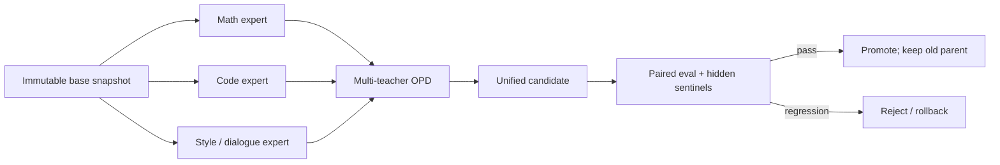

# Capability Factory L0 — 从“专家并行生产”到“统一模型可安全晋升”

> **核心问题**：领域专家能并行训练以后，能力怎样集成，集成结果又凭什么取代 parent？
>
> **先修**：[nano-opd L0](../01-post-training-rl-sft/nano-opd/tutorial_L0.md) 的 reverse-KL；
> 知道 categorical sampling、paired evaluation 和 checkpoint 的含义。
>
> **不变量**：学生轨迹与 teacher/policy/evaluator 版本必须绑定；teacher routing 是目标的一部分；
> 任何晋升都必须保留可追溯 parent 和 rollback target。
>
> **运行**：纯 Python 标准库、CPU、数秒内完成；固定 seed。数字是机制 toy，不是模型 benchmark。
>
> **验收**：脚本 9/9 self-check；能解释两种 OPD 估计器的差别，并指出三个候选为何一升两拒。
>
> **边界**：不证明 OPD 普遍优于 RL，不把厂商自报结果当独立复现，也不把模型辅助研发等同于 RSI。

---

## 1. 为什么“能力工厂”比“又一个新模型”更本质

传统的大一统 mixed RL 把数学、代码、agent、写作等目标放在同一训练任务里。问题不只是在 loss
之间调权重：不同领域的数据速度、reward 密度、环境失败率和 rollout 长度都不同。一个领域的更新
改变共享参数后，另一个领域看到的策略分布也变了；训练失败时很难定位是专家没学会，还是集成时被覆盖。

新的生产分解是：从同一个 base 分出多个领域 branch，各自用最合适的 SFT/RLVR/agentic RL 训练；
最后让统一 student 在自己的轨迹上接受相关 teacher 的 dense distribution feedback。DeepSeek-V4
报告明确描述了“领域 SFT + GRPO 产生十多个专家，再以 multi-teacher OPD 集成”的流水线；MiMo-V2-Flash
也报告使用 Multi-Teacher On-Policy Distillation。这里最有价值的变化是：

> **能力生产与能力集成成为两个可独立调度、独立观测、独立失败的阶段。**



这解释了为什么研发周期可能同步加速，但还没有证明“能力像微服务一样无损组合”。模型专家没有硬接口
和隔离内存；它们共享 student 的有限容量，可能发生 teacher conflict、路由错误、遗忘和组合任务退化。

---

## 2. 同属 OPD，不等于同一种估计器

设 student 为 $q_\theta$，领域 $d$ 的 teacher 为 $p_d$。在 student 自己产生的前缀
$s_t=(x,y_{<t})$ 上，token 级 reverse-KL 为：

$$
D_{\mathrm{KL}}\left(q_\theta(\cdot\mid s_t)\parallel p_d(\cdot\mid s_t)\right)
=\sum_{v\in V}q_\theta(v\mid s_t)
\left[\log q_\theta(v\mid s_t)-\log p_d(v\mid s_t)\right].
$$

### 2.1 Full-vocabulary OPD

对词表 $V$ 精确求和，保留 teacher 和 student 的完整 token 分布。DeepSeek-V4 报告采用这一变体，
并为此缓存 teacher 最后一层 hidden state，在训练时经 prediction head 重建 full logits，再用专门 kernel
计算 exact KL。

优点是每个前缀都有低方差的完整分布监督；代价是 teacher forward、hidden state/logit transport、
prediction head 调度和 $|V|$ 维 KL 都很重。这里的“full-vocabulary”只表示**给定 student 前缀时对
下一个 token 全词表求和**；轨迹前缀仍来自 student，因此仍是 on-policy。

### 2.2 Sampled-token MOPD

也可以只取 student 实际采样出的 $y_t$，把负 reverse-KL cost 写成 policy-gradient advantage：

$$
\hat A_t=\operatorname{sg}\left[
\log p_d(y_t\mid s_t)-\log q_{\mathrm{old}}(y_t\mid s_t)
\right],\qquad y_t\sim q_{\mathrm{old}}.
$$

NeMo RL 的 MOPD 文档采用这一路线：teacher 只返回 sampled token 的 log-prob，不传完整词表分布。
它显著降低 teacher 通信与存储，但用 Monte Carlo 方差交换系统成本，并需要认真处理异步 off-policy drift。

| 维度 | Full-vocabulary OPD | Sampled-token MOPD |
|------|---------------------|--------------------|
| teacher 信号 | 每个前缀的完整词表分布 | 仅学生实际 token 的 teacher log-prob |
| 梯度方差 | 较低 | 较高，随样本数下降 |
| 传输/存储 | hidden state 或 $|V|$ logits 很重 | 标量 log-prob 较轻 |
| 主要系统题 | teacher offload、head 调度、fused KL | rollout 吞吐、版本一致性、IS/off-policy gate |
| 共同不变量 | student-generated prefixes；teacher/policy/router 版本必须绑定 | 同左 |

因此“DeepSeek、MiMo 都用了 OPD”是机制家族层面的真话；把它们写成同一种具体计算则会漏掉最值得教的
算法—系统权衡。

---

## 3. 先跑：看见方差、错路由与 gate

在本目录运行：

```bash
python3 capability_factory_lab.py
```

脚本分三层：

1. 对同一个 reverse-KL 比较 full-vocabulary 精确梯度与 sampled-token Monte Carlo 梯度；
2. 把三个领域 teacher 循环错配，观察目标值和梯度方向改变；
3. 让三个统一模型候选经过 candidate-parent 配对 gate。

关键输出应满足：

```text
sampled tokens=  16 | gradient RMSE=...
sampled tokens= 256 | gradient RMSE=...
sampled tokens=4096 | gradient RMSE=...
...
mixed-rl-public-peak   REJECT
opd-integrated-v1      PROMOTE
opd-router-bug         REJECT
...
SELF-CHECK: 9/9 PASS
```

如果只盯公开集总分，第一个候选最像“重大突破”；它被拒绝是因为隐藏配对差为负，而且代码领域回归。
第三个候选的公开、隐藏平均分都上涨，但 teacher router 错误造成单领域严重回归，也必须拒绝。只有第二个
候选同时满足公开增益下界、隐藏 sentinel、最坏领域回归、成本和 lineage 条件。

---

## 4. sampled-token 为什么是无偏但有方差

令 $q=\operatorname{softmax}(z)$。单个前缀上的精确梯度为：

$$
\frac{\partial D_{\mathrm{KL}}(q\parallel p)}{\partial z_k}
=q_k\left[\log q_k-\log p_k-D_{\mathrm{KL}}(q\parallel p)\right].
$$

若 $y\sim q$，则可用 score-function 估计：

$$
\hat g_k=(\mathbf 1[y=k]-q_k)
\left[\log q_y-\log p_y-b\right].
$$

取不依赖 $y$ 的 baseline $b$ 不改变期望；脚本为了隔离采样方差，直接用 exact KL 作 baseline。多次重复后，
sample 数从 16 增到 4096，RMSE 应稳定下降。这里没有证明某个生产实现更快：full-vocabulary 可能受
teacher/logit 通信限制，sampled-token 可能受更多 rollout 和方差限制，胜负取决于模型、词表、网络拓扑、
可接受方差与 teacher 部署方式。

---

## 5. teacher routing 不是外围配置，而是目标的一部分

多教师目标可以抽象为：

$$
\mathcal L(\theta)=
\mathbb E_{d,s_t\sim q_\theta}
\left[\sum_i w_i(d,s_t)
D_{\mathrm{KL}}\left(q_\theta(\cdot\mid s_t)\parallel p_i(\cdot\mid s_t)\right)\right].
$$

$w_i$ 由领域、任务或 router 决定。换一个 router，不只是影响吞吐，而是直接换了优化目标。一个错误的
router 完全可能 loss 平滑下降：代码 student 正在稳定地模仿写作 teacher，训练系统不会因为目标错了而
自动报错。

因此每条蒸馏 record 至少要绑定：

```text
prompt/source + student_policy_version + sampled tokens/mask
teacher_id + teacher_checkpoint_digest + router_version
teacher signal kind(full_vocab/sampled_token) + teacher logprob/logit artifact
old_logprob + environment/tool trace + evaluator_version
```

这正是统一 EpisodeRecord 教程应补的字段：算法名字不能替代“样本来自谁、谁给分、由哪个版本给分”。

---

## 6. promotion gate：集成完成不等于改进成立

脚本使用一个故意简单的一侧 normal LCB：

$$
\operatorname{LCB}_{0.95}(\Delta)
=\bar\Delta-1.645\frac{s_\Delta}{\sqrt n}.
$$

真实项目必须根据指标分布、样本相关性和 sequential decision 方式选择合适估计器；这里的正态近似只用于
讲 gate 的控制流。最小 gate 同时检查：

- 公开集 paired delta 的下界是否为正；
- 隐藏 sentinel 的 paired delta 下界是否非负；
- 任一核心领域是否超过允许回归上限；
- 成本/延迟是否越界；
- candidate、parent、teachers、router 和 evaluator 的 lineage 是否闭合。

一个更贴近“能力集成”的指标是领域专家增益保留率：

$$
R_d=\frac{S_d(U)-S_d(B)}{S_d(E_d)-S_d(B)+\epsilon},
$$

其中 $B$ 是 base，$E_d$ 是领域专家，$U$ 是统一 student。总平均 $R_d$ 很高仍可能掩盖一个领域灾难性
退化，所以同时报告 $\min_d R_d$、$\min_d[S_d(U)-S_d(B)]$ 和 teacher disagreement。不要用一个 aggregate
benchmark 代替能力向量。

---

## 7. “能力微服务”比喻在哪里失效

| 比喻成立的部分 | 比喻失效的部分 |
|----------------|----------------|
| 专家 branch 可以并行排期、独立训练与版本化 | 专家没有硬 API/内存隔离，最后共享 student 参数 |
| teacher 可以按任务选择，形成相对清晰的生产接口 | teacher disagreement 不能靠普通 service routing 自动消解 |
| 新专家可增量加入集成流水线 | student 容量有限，加入专家可能让旧能力遗忘 |
| 集成阶段可单独计时、失败与重跑 | 蒸馏不是无损链接，组合任务可能出现未在单专家上观测的行为 |

所以更准确的说法是：**能力生产过程开始模块化；能力表示本身仍是纠缠的。**

---

## 8. “模型参与研发”要分层，不要一步跳到 RSI

| 层级 | 模型做了什么 | 能证明什么 | 仍缺什么 |
|------|--------------|------------|----------|
| A | 生成代码、测试、实验建议 | 高价值研发助手 | 人定义任务并验收 |
| B | 在固定 harness 内搜索 kernel/compiler 优化 | bounded optimizer | 外部 evaluator、权限和停止条件 |
| C | 提议训练配方、数据或架构，触发候选训练 | 研发环部分自动化 | 因果消融、预算控制、独立 promotion |
| D | 修改模型或 evaluator，并决定后继版本 | 接近递归闭环 | immutable anchors、evaluator succession、rollback、审计 |

Kimi K3 官方材料报告了 kernel、compiler、CAD 和 chip-design 等长时任务能力，这支持 A/B 层“模型已进入
研发工作流”；它本身没有证明 D 层可靠 RSI。把层级分开，课程才能同时承认真实进展并守住证据边界。

---

## 9. 后续 L1–L3 的实验矩阵

L1 真模型实验从同一 base、同一初始数据快照出发，至少训练两个领域专家；统一 compute/token budget，比较：

| 方法 | 要回答的反事实问题 |
|------|--------------------|
| Mixed training / mixed RL | 不拆专家时，跨领域干扰和 wall-clock critical path 怎样？ |
| Parameter merge | 不看 student 自己的状态分布，直接合权重损失什么？ |
| Off-policy KD | 固定教师数据能否覆盖 student 部署时访问的前缀？ |
| Sampled-token OPD | 节省多少 teacher 传输，需增加多少 rollout 才达到相同方差？ |
| Full-vocabulary OPD | 低方差信号是否值得 hidden-state/logit transport 成本？ |

必须同时报告：每领域 expert score、统一模型 score、$R_d$、最坏回归、teacher disagreement、训练 token、
GPU-hours、峰值显存、跨节点字节、time-to-promotion 和失败发现延迟。L2 加 stale teacher、错路由、worker
preemption 和断点恢复；L3 再加入 hidden sentinel、rollback 演练、evaluator succession 与 stopping。

L1 可在隔离的 GPU 环境开展真实小模型实验；L0 不应为了“像生产”而使用 GPU，因为它要隔离的是
估计器与 gate 的不变量。

---

## 10. 证据分层与来源

- **一手系统报告（厂商自报，尚不等于独立复现）**：
  [DeepSeek-V4](https://arxiv.org/html/2606.19348v1) 描述领域专家、十多个 teacher、full-vocabulary
  reverse-KL、hidden-state 缓存/logit 重建与容错 rollout；
  [MiMo-V2-Flash](https://github.com/XiaomiMiMo/MiMo-V2-Flash) 描述 MOPD、agentic RL 和相关 infra；
  [Kimi K3](https://github.com/MoonshotAI/Kimi-K3) 描述混合注意力/MoE 与长时研发任务能力。
- **公开实现事实**：
  [NeMo RL MOPD](https://github.com/NVIDIA-NeMo/RL/blob/main/docs/about/algorithms/mopd.md)
  明确采用 sampled-token teacher-minus-student log-prob advantage，并配置异步 drift gate。
- **综合解释/待因果验证**：
  “同期发布主要来自生产范式成熟”“能力已成为微服务”“benchmark 形状排除复制”等属于有启发的产业推断；
  若要升级为因果结论，需要跨组织可比消融、统一评测与独立复现。

---

## 11. 费曼自检

1. 为什么 full-vocabulary OPD 仍然叫 on-policy？“full”覆盖的是词表还是轨迹？
2. sampled-token estimator 为什么省通信，却不能说它和 full-vocabulary KL 的训练行为完全相同？
3. teacher router 错了，为什么 loss 仍可能漂亮地下降？
4. 公开平均分上涨时，hidden sentinel 和最坏领域回归分别防什么？
5. 为什么“模型优化了 kernel”是研发自动化证据，却不是可靠 RSI 的充分证据？

一句话验收：**专家可以并行生产，但集成不是无损拼装；只有经过版本绑定、能力向量评估、独立晋升与可回滚
谱系，统一 candidate 才有资格替换 parent。**
