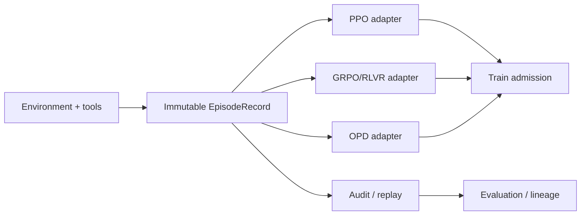

# EpisodeRecord L0 — 算法会换，轨迹事实不能丢

> **核心问题**：一条 rollout 进入训练前，哪些事实必须固定下来？
>
> **先修**：知道 token、log-prob、reward、value 和 tool call；不要求会某个框架 API。
>
> **不变量**：provenance、termination semantics、token mask、版本身份和环境/tool trace 先于算法。
>
> **运行**：`python3 episode_record_lab.py`；纯标准库、CPU、固定输出。
>
> **验收**：9/9 self-check；能解释同一 record 为什么可被三个算法消费，以及五种错误为何必须 fail closed。
>
> **边界**：L0 用 tuple 模拟 token-aligned tensor；不声称已实现生产级存储或 exactly-once admission。

---

## 1. 先问“发生过什么”，再问“用哪个算法学”

PPO 教程关心 `old_logprob/value`，GRPO 教程关心 `group_id/reward`，OPD 教程关心 teacher log-prob，
agent 教程又关心 actions、observations 与环境状态。若各模块各造一种样本对象，读者容易把字段误认成算法私有
细节，忽略真正的边界：**训练算法可以重算 advantage，不能重写历史轨迹发生时的身份与终止事实。**



统一合同的价值不是让所有算法拥有完全相同的必填字段，而是分开两类信息：

- **历史事实**：prompt 从哪来、谁生成、在哪个环境、是否真正终止、调用过什么工具；
- **算法观测**：old/reference/teacher log-prob、value、reward vector、group id。

前者缺失时不能靠训练代码猜；后者可以由特定 adapter 判定是否满足算法需求。

---

## 2. 最小字段表：谁产生，谁消费，缺失会怎样

| 字段 | 产生者 | 主要消费者 | 缺失/错配风险 |
|------|--------|------------|---------------|
| `episode_id`, `prompt_source` | data/rollout coordinator | lineage、去重、审计 | 无法重放，重复训练不可辨识 |
| `token_ids`, `loss_mask` | tokenizer/template/rollout | 所有 token loss | prompt/tool/pad token 被误训练 |
| `old_logprobs` | rollout policy | PPO/IS、部分 OPD 实现 | ratio 无定义或拿错行为策略 |
| `reference_logprobs` | reference policy | KL regularization/诊断 | reference 漂移不可见 |
| `teacher_logprobs` | teacher scorer | sampled-token OPD | dense teacher signal 无法重建 |
| `rewards` | reward/verifier | PPO、GRPO/RLVR | reward component/version 不可追溯 |
| `values`, `bootstrap_value` | critic/value service | PPO/GAE | truncation target 被系统性压低 |
| `done`, `truncated` | environment/harness | return/GAE/replay | 时间截断被误当真正 terminal |
| `group_id` | prompt sampler | GRPO-family | 不同 prompt 混组或 dead group 不可诊断 |
| `actions`, `observations` | agent harness/tool runtime | agent training、审计 | 副作用与模型文本无法对账 |
| version bundle | orchestrator/registries | admission、replay、promotion | stale policy/teacher/evaluator 静默混入 |

`policy_version` 应是可绑定实际权重、tokenizer 和 template 的不可变身份；只有 `global_step=42` 不够，因为不同
run、分支或重启都可能有 step 42。L0 用 `policy-sha256:...` 强调这一点，生产可以用 manifest digest。

---

## 3. 先跑起来

```bash
python3 episode_record_lab.py
```

核心输出：

```text
[1] Algorithm admission on the same record
    ppo  -> ADMIT
    grpo -> ADMIT
    opd  -> ADMIT

[2] done != truncated: bootstrap changes the target
    truncated target = 1.0 + 0.99*0.70 = 1.693
    terminal  target = 1.0             = 1.000
    silent bias if truncation is treated as terminal = -0.693

[3] Fail closed before train admission
    missing bootstrap        -> REJECT
    stale policy             -> REJECT
    teacher/router mismatch  -> REJECT
    broken tool trace        -> REJECT
    missing provenance       -> REJECT
```

同一记录能进入三个 adapter，不代表三种算法等价；它只说明这条记录保留了三者需要的超集字段。

---

## 4. `done` 与 `truncated` 不是命名偏好

真正 terminal 表示环境过程结束，因此边界后的 value 是 0：

$$
y_t=r_t.
$$

时间、长度或资源预算造成的 truncation 只表示“记录在这里切断”，环境状态未必终止：

$$
y_t=r_t+\gamma V(s_{t+1}).
$$

脚本中 $r=1,\gamma=0.99,V(s_{t+1})=0.70$，正确 target 是 1.693。若只保留一个 `finished=True`，
训练端就会误写成 1.0，产生 -0.693 的确定性偏差。增大 batch 只会更精确地学习这个错误 target。

因此：

- `done=True` 与 `truncated=True` 互斥；
- truncated record 必须携带 bootstrap value 或足够重算它的 next-state/version；
- terminal record 不能携带非零 bootstrap；
- 恢复 agent 执行时还需环境 checkpoint，token record 本身不等于可恢复环境。

---

## 5. 同一条 record，三个 adapter 各消费什么

### PPO

PPO 至少需要当前 response token 的 action、`old_logprob`、reward、value、mask 和 termination/bootstrapping；
若使用 reference KL，还要 reference log-prob。训练时产生 `new_logprob`，再计算
$\exp(\log\pi_{new}-\log\pi_{old})$。`old_logprob` 必须对应 record 中那版 policy 和同一前缀状态。

### GRPO/RLVR

GRPO 可以不要 critic/value，但必须知道哪些 response 属于同一个 prompt group。脚本把组回报标准化；若组内
回报全部相同，方差为 0，relative advantage 没有学习信号，显式报 `dead group`。生产系统可能跳过、重采样或
使用其他 estimator，但不能悄悄除以 epsilon 后把“无信号”伪装成正常样本。

### Sampled-token OPD

该变体需要 student rollout 的 token、old/student log-prob 与相同前缀上 teacher 对实际 token 的 log-prob；
multi-teacher 时还必须固定 `teacher_id/router_version`。Full-vocabulary OPD 还需要完整 logits，或可重建它的
teacher hidden-state artifact 和 prediction-head version；L0 的标量字段只覆盖 sampled-token 形态。

---

## 6. 版本检查为什么应该发生在 train admission 之前

脚本故意注入 stale policy 与错 router。二者的 tensor shape 都合法，loss 甚至可能稳定下降；只有 admission
context 知道这批数据是否属于本次训练允许的版本集合。

```text
rollout accepted
  iff schema valid
  and policy/teacher/router/environment versions allowed
  and algorithm-required fields present
  and lease/attempt not already admitted
```

L0 尚未实现最后一项 exactly-once；L2 应给每个 `(episode_id, attempt_id, trainer_run_id)` 设置原子 admission
记录，避免 worker retry 后同一轨迹被训练两次。注意 exactly-once train admission 不等于整个分布式系统
exactly-once：外部工具副作用需要单独的 idempotency/transaction 协议。

---

## 7. EpisodeRecord 与训练 batch 不应是同一个对象

EpisodeRecord 是 append-only 事实；batch 是按当前算法临时派生的视图。把二者分开有三个好处：

1. 相同轨迹可以用新 evaluator 离线重评，而不覆盖旧 reward；
2. PPO/GRPO/OPD adapter 可以各自决定 packing、padding 和字段消费；
3. evaluator 或 schema 升级时可 versioned migration，不必篡改历史记录。

推荐的数据流是：

```text
immutable EpisodeRecord
  -> validate + version gate
  -> algorithm adapter
  -> ephemeral tensor batch
  -> train attempt record
```

不要把训练后更新的 `new_logprob/advantage` 回写覆盖原 record；它们属于某个 train attempt 的派生 artifact。

---

## 8. 反例与费曼自检

**类比**：EpisodeRecord 像飞机黑匣子，算法 adapter 像不同事故调查组。调查组会计算不同指标，但不能把飞行时
用的仪表版本、是否真正落地、控制指令和外部观察各记一套；否则大家讨论的是不同事故。

反例：只保存 prompt/response/reward，能不能以后补齐？通常不能——old policy 可能已删除，tool environment
已经改变，truncation 的 next-state 不在，teacher/router 也可能升级。缺失的是历史事实，不是可派生缓存。

思考题：

1. 为什么 `policy_version=step_100` 不能唯一绑定行为策略？
2. reward model 升级后，应覆盖旧 reward 还是新增 `reward-v5` 派生结果？
3. 一个 response 同时包含 assistant token、tool call 和 tool observation，哪些 token 应进入 loss mask？
4. 若 full-vocabulary OPD 只存 teacher hidden state，还要绑定哪些 prediction-head/tokenizer 信息？
5. rollout worker 在提交后超时重试，怎样阻止同一 episode 被 train admission 两次？

一句话验收：**算法决定消费哪些字段；provenance、终止语义和版本身份决定这些字段有没有资格被相信。**
