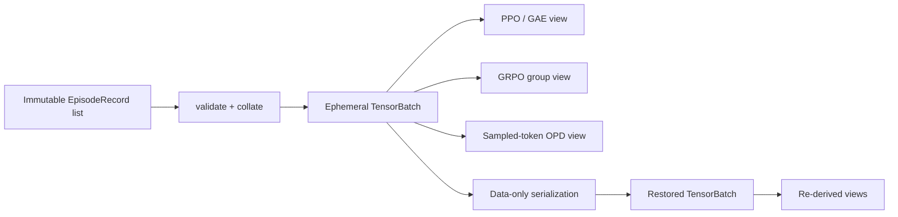

# EpisodeRecord L1 — 从不可变轨迹到可恢复 tensor batch

> **核心问题**：多条可变长 EpisodeRecord 怎样变成 PPO、GRPO 和 sampled-token OPD 都能安全消费的
> PyTorch batch，同时不让 padding、终止语义或版本身份在转换中丢失？
>
> **先修**：先跑 [L0](tutorial_L0.md)，理解 record admission、`done != truncated`、group 与版本合同；
> 建议读过 [nano-verl L1](../01-post-training-rl-sft/nano-verl/tutorial_L1.md) 的 GAE。
>
> **不变量**：有效 token、response loss mask、termination/bootstrap、group、policy/reward/evaluator/
> environment/teacher/router identity 在 record → batch → algorithm view → round-trip 全链不变。
>
> **运行**：`python3 L1_tensor_batch.py`；PyTorch 2.13 CPU，通常数秒；不需要 GPU。
>
> **验收**：13/13 self-check；能解释 episode-level 中心化为何不保证 token-level 中心化，以及
> tensor round-trip 为什么仍不等于 exactly-once train admission。
>
> **边界**：本级实现真实 tensor/adapter，不做模型 forward、packing、持久 EpisodeStore、并发 lease 或训练事务。

---

## 1. 为什么 L0 合法，进 batch 后仍可能错

L0 已经能拒绝 stale policy、缺 bootstrap、错 teacher/router 和 broken tool trace。但训练代码通常不直接逐条
读取 dataclass，而会先把不同长度的轨迹 padding 成矩阵。错误经常发生在这一步：

1. `attention_mask` 正确，`loss_mask` 却把 padding 或 prompt token 选进 loss；
2. `done` 和 `truncated` 被压成一个 batch 级 `finished`，GAE 边界失真；
3. GRPO 先在 episode 上标准化，再广播到 token，loss reduction 却悄悄按长度重新加权；
4. teacher log-prob tensor 对齐了 shape，但 `teacher_id/router_version` 留在 batch 外面；
5. 保存 tensor 时只存数值，不存 record 长度、group 和版本 metadata，恢复后“能算”但不可审计。

所以 L1 的主角不是一种新算法，而是三层对象的边界：



- **record** 是发生过的事实，原则上 append-only；
- **TensorBatch** 是为当前设备、padding 策略和吞吐形态构造的临时视图；
- **algorithm view** 是当前 loss 真正消费的字段子集与派生量。

不要把后两者回写覆盖前者。换 padding、packing 或 estimator 时可以重建 batch，不能重写 rollout 当时用的
policy、teacher、environment 和 termination。

---

## 2. 先跑：四条可变长轨迹进入同一个 batch

```bash
python3 L1_tensor_batch.py
```

参考 CPU 实跑输出：

```text
==============================================================================
EpisodeRecord L1 — immutable records -> tensor batch -> algorithm views
==============================================================================

[1] Right-padded tensor batch
    shape=(4, 4) lengths=[4, 3, 3, 2]
    attention tokens=12 trainable tokens=8
    padding selected by loss=0

[2] PPO/GAE boundary semantics
    truncated ep-A1 last target=1.693 (1 + .99*.70)
    terminal  ep-A2 last target=0.000 (0, no bootstrap)

[3] GRPO group gate
    returns=[1.0, 0.0, 0.5, 0.5]
    admitted rows=[True, True, False, False] quarantined=('prompt-B',)
    prompt-A episode advantages=[1.0, -1.0] (centered)
    after token broadcast, row sums=[3.0, -2.0] (length weighting)

[4] Sampled-token OPD view
    aligned teacher signals=8 padding signals=0
    teacher/router identities=[('teacher-math-v2', 'router-v3')]

[5] Fail closed: mask-on-padding -> REJECT | loss_mask cannot select padding

[6] round-trip + self-check
    tensors bitwise equal=True metadata equal=True
    PASS | variable-length records collate to [4,4]
    PASS | attention mask counts real tokens
    PASS | padding never enters loss
    PASS | truncation bootstraps
    PASS | terminal boundary does not bootstrap
    PASS | dead GRPO group is quarantined
    PASS | valid GRPO episode advantages are centered
    PASS | token broadcast exposes length weighting
    PASS | OPD signals align only to trainable tokens
    PASS | batch gate rejects mask-on-padding
    PASS | round-trip preserves every tensor bitwise
    PASS | round-trip preserves metadata and versions
    PASS | views are resume-stable

SELF-CHECK: 13/13 PASS
takeaway: records are facts; padded batches and algorithm views are reproducible derivatives.
```

四条 record 的 token 长度是 4/3/3/2，总真实 token 数 $4+3+3+2=12$。每条第一个 token 是 prompt，
不进入 response loss，所以 trainable token 数是 $3+2+2+1=8$。

---

## 3. `attention_mask` 与 `loss_mask` 回答不同问题

脚本使用右 padding，得到 `[batch=4, time=4]`：

```text
attention_mask: 这个位置是不是本条序列的真实 token？
loss_mask:      这个真实 token 是否属于当前训练目标？
```

必须满足：

$$
\text{loss\_mask}_{b,t} \le \text{attention\_mask}_{b,t}.
$$

但两者不能合并。prompt、tool observation 或模板 token 可以参与 attention，却不应该成为当前 assistant loss
的 target；padding 则两者都为 0。脚本故意把第 4 行的一个 padding 位设成 `loss_mask=True`，batch gate 在
进入 loss 前拒绝。

这里还有三个容易混淆的边界：

- 不能用 `input_ids == pad_id` 反推 mask；某些 tokenizer 会让 pad/eos 共享 ID，语义来自显式 mask；
- 右 padding 不是普遍最优布局。本实验不做 decoder forward；真实模型必须让 padding 方向、position id、
  causal attention 与 rollout 时的前缀状态一致；
- padding 不等于 packing。packing 会把多条样本放入同一序列，还必须阻断跨样本 attention；本级没有做。

`TensorBatch.metadata` 同时保存每行真实长度和版本 bundle。tensor shape 正确只是必要条件，不是 provenance
正确的充分条件。

---

## 4. PPO/GAE：边界语义必须逐条保留

对 response token，脚本从后向前计算：

$$
\delta_t=r_t+\gamma V_{t+1}-V_t,
$$

$$
A_t=\delta_t+\gamma\lambda A_{t+1},\qquad
\hat V_t=A_t+V_t.
$$

关键不是递推公式，而是最后一个有效 response token 的 $V_{t+1}$ 从哪里来：

| 边界 | 最后一步 next value | 原因 |
|------|---------------------|------|
| `done=True` | 0 | 环境真正 terminal |
| `truncated=True` | `bootstrap_value` | 只是记录/预算边界，过程未必终止 |

`ep-A1` 的最后奖励是 1，bootstrap 是 0.70：

$$
\hat V_{last}=1+0.99\times0.70=1.693.
$$

`ep-A2` 真正 terminal，最后奖励为 0，因此 target 是 0。若 collate 时只保留一个 `finished`，后面的 GAE
函数已经无法恢复这个区别；这是信息丢失，不是换个超参数能修复的误差。

本实验的 `old_logprobs` 是 rollout 行为策略的记录。真实 PPO trainer 还要用当前 policy 在相同 token、mask、
前缀状态上重算 `new_logprobs`；L1 没有模型 forward，因此没有伪造 ratio 或优化结果。

---

## 5. GRPO：episode 中心化后，token reduction 仍会改变权重

同一 prompt group 内，episode return 为 $(1.0,0.0)$，按总体标准差归一化：

$$
A_i=\frac{R_i-\bar R}{\operatorname{std}(R)}=(1,-1),
$$

所以 episode 维度上 $\sum_i A_i=0$。另一个 group 的 return 是 $(0.5,0.5)$，标准差为 0，脚本把整个组
标为 quarantine，而不是用一个 epsilon 把“没有 relative signal”伪装成正常数据。

真正反直觉的地方来自 token 广播。两个有效 episode 的 response 长度分别是 3 和 2；广播后每行 advantage
和变成 $(3,-2)$。若 loss 对所有 token 直接取平均，它看到的均值是：

$$
\frac{3\times1+2\times(-1)}{3+2}=0.2\ne0.
$$

这不说明广播实现错了，而说明 **group-level estimator 与 loss reduction 是两个独立设计选择**：

- episode-mean：每条 response 先按自身有效 token 归约，再对 episode/group 平均；
- token-mean：长 response 有更多 token，因此权重更大；
- 其他方案还可能按 group、长度、difficulty 或 importance weight 重新归约。

教材或代码若只说“GRPO advantage 已标准化”，却不说明最终 reduction，就少了一半语义。可继续对照
[reward/dead group](../01-post-training-rl-sft/nano-trinity-rft/tutorial_L2.md) 与
[PPO 数据流](../01-post-training-rl-sft/nano-verl/tutorial_L1.md)。

---

## 6. Sampled-token OPD adapter：对齐信号，不伪造完整 loss

`opd_view` 输出三个核心对象：

```text
student_sample_logprobs  # rollout 时行为策略在实际 token 上的 log-prob
teacher_sample_logprobs  # 同一前缀、同一实际 token 上的 teacher log-prob
mask                     # 只选实际训练 token
```

并保留每行 `(teacher_id, router_version)`。本 batch 的 8 个 trainable token 恰有 8 个 teacher signal，padding
没有信号。shape 对齐仍不够：若 teacher/router identity 错了，数字看起来完全合法，却对应了错误能力源。

本脚本有意**不计算完整 OPD loss**。训练时当前 student 已可能不同于 rollout policy，需要在相同前缀上重算
当前 student log-prob；full-vocabulary OPD 还要完整 teacher/student distribution 或可重建它们的 artifact。
L1 只证明 sampled-token 字段和版本怎样进入 batch，不把 adapter 冒充优化算法。

继续阅读：[nano-opd L0](../01-post-training-rl-sft/nano-opd/tutorial_L0.md) 与
[Capability Factory L0](../cross-track-capability-factory/tutorial_L0.md)。

---

## 7. Round-trip 恢复证明了什么，没有证明什么

脚本把 tensor 与 data-only metadata 放进一个带 `schema_version=1` 的 payload，经 `torch.save` 写入内存，再用
`torch.load(..., weights_only=True)` 恢复。验收分三层：

1. 所有 tensor `torch.equal`，逐元素、dtype 和 shape 一致；
2. metadata 的 episode/group/length/provenance/version identity 一致；
3. 从恢复 batch 重新派生 PPO/GRPO/OPD view，结果一致。

它没有证明序列化字节是跨 PyTorch 版本的 canonical format，所以脚本不拿文件字节 hash 当 record identity；
更没有证明训练 exact resume。完整训练恢复还需 model、optimizer、scheduler、RNG、data cursor 等状态，可对照
[pretraining lifecycle L0](../02-pretraining-cpt/nano-pretraining-loop/tutorial_L0.md)。

最重要的边界是：**round-trip consistency 不等于 exactly-once admission**。两个 worker 可以各自恢复同一 batch，
然后都训练一次；只有持久 admission key、原子状态转移、lease/attempt 与 append-only train record 才能阻止重复
消费。这正是 L2 的主题。

---

## 8. 代码控制流：检查顺序本身就是机制

```text
L0 record admission
  -> collate variable lengths
  -> validate shape + mask + boundary + metadata length
  -> derive PPO / GRPO / OPD views
  -> serialize data-only payload
  -> restore and re-derive
  -> compare tensors, metadata and views
```

为什么 gate 放在 adapter 前？因为错误 mask 或边界若先进入 loss，训练代码可能给出一个有限、平滑、甚至下降的
标量；“数值能算”会掩盖“语义不合法”。fail closed 的价值就是让错误在最靠近合同的位置显性化。

生产实现还应补：

- dtype/device policy 与 pinned-memory transfer；
- tokenizer/template/position-id identity；
- packed sequence 的 sample boundary；
- reward component tensor 与 component-version map，而不只一个聚合 reward；
- schema migration、quarantine reason、lease expiry 与 train attempt identity。

---

## 9. 费曼自检与反例

**类比**：EpisodeRecord 是仓库里的原始发票；TensorBatch 是会计临时做的工作表；PPO/GRPO/OPD view 是三个
不同报表。工作表可以补空格、换列宽，报表可以用不同公式，但发票日期、交易方和金额来源不能跟着报表改变。

自检题：

1. `attention_mask=1, loss_mask=0` 的位置可能是什么？
   - prompt、tool observation、模板 token；它参与上下文，但不是当前监督目标。
2. 为什么 episode advantages $(1,-1)$ 广播后 token mean 不是 0？
   - 两条 response 长度不同，token reduction 把长度变成隐式权重。
3. `torch.equal` 全通过，为什么仍可能重复训练？
   - 它只证明恢复内容一致，没有持久、原子的消费记录。
4. sampled-token OPD 为什么还需要当前 student forward？
   - record 中是 rollout/old policy 的 log-prob；更新策略后的 student distribution 必须重新计算。
5. 为什么 metadata 不能全换成整数列然后不记 schema？
   - 整数只保留值，不保留含义；版本升级后字段解释、枚举和 identity 仍可能漂移。

反例：把 pad 位设为 loss 位，shape、dtype 和矩阵乘法都合法；本级 gate 仍拒绝。高级系统错误往往不是 tensor
无法计算，而是一个语义错误的 tensor 计算得太顺利。

一句话验收：**record 固定事实，batch 固定布局，adapter 固定算法消费；三层都可恢复，但只有下一层持久
admission 才能固定“是否已经训练过”。**

---

## 10. 下一层：从可恢复 batch 到可审计消费

L2 将新增 append-only EpisodeStore，并把下面状态机做成可运行故障注入：

```text
STORED -> LEASED(attempt, expiry) -> ADMITTED(trainer_run) -> CONSUMED
              | expiry/crash
              +--------------------> AVAILABLE
```

验收重点不是“能写 SQLite/JSONL”，而是：重复提交、过期 lease、旧 schema、stale policy、worker 崩溃与
commit-response 丢失时，系统能否给出唯一、可审计、可恢复的 train admission 结论。
