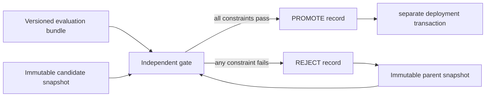

# Evaluation Gate L0 — 平均分上涨，为什么仍不能晋升

> **核心问题**：怎样把“candidate 看起来更好”变成一个可拒绝、可复算、可回滚的晋升判据？
> **先修**：[EpisodeRecord L0](../cross-track-episode-record/tutorial_L0.md) 的版本/provenance 概念；能理解均值。
> **不变量**：parent 与 candidate 必须在同一 task、seed、数据快照、evaluator 和环境版本上比较。
> **运行**：`python3 evaluation_gate_lab.py`；纯标准库、CPU、数秒；全部数据均为 synthetic toy。
> **验收**：8/8 self-check；headline 均分和区间过门但 sentinel 退化时必须 `REJECT`。
> **边界**：本节不证明任务 iid、评估无污染、evaluator 永不漂移，也不执行真实部署回滚。

---

## 1. 先把权力边界画清楚



训练器可以生成 candidate，却不应自己批准 candidate。否则优化目标、评测证据和晋升裁决住在同一个
可修改回路里：当 reward 被钻空子、测试集泄漏或 evaluator 漂移时，系统会把“更会得分”误认成“能力更强”。

L0 把 gate 做成纯函数：输入一个绑定版本的 `EvalBundle`，输出不可变 `PromotionRecord`。它不改模型，
也不执行部署；这让“证据是否足够”和“如何切流量”成为两个可以分别失败、分别审计的事务。

---

## 2. 为什么必须做 candidate-parent 配对

设同一任务 $i$ 上 parent 和 candidate 的分数分别为 $p_i$、$c_i$。我们关心的不是两个独立均值，
而是逐任务差值：

$$
d_i = c_i - p_i, \qquad \bar d = \frac{1}{n}\sum_{i=1}^{n}d_i.
$$

如果简单任务恰好更多分给 candidate、困难任务更多分给 parent，两个均值的差既含模型差异，也含任务差异。
配对让同一任务自身成为 control，抵消一部分 task difficulty。对于有采样噪声的模型，seed、sampling config、
tool/environment 版本也属于 pair identity；只对上 task 名字还不够。

脚本让 `EvalRow` 同时保存 parent/candidate score 和两边 seed，并拒绝：

- 相同 `(task_id, seed)` 重复出现；
- parent seed 与 candidate seed 不同；
- score 越界、split 非法或版本身份缺失；
- 总覆盖或 hidden 覆盖不足。

证据格式不合法时结果是显式 `REJECT`，而不是“跳过坏行后继续算”。这就是 fail closed。

---

## 3. 一个正均值仍然只是点估计

一次评测得到 $\bar d>0$，不能说明换一批任务仍然为正。脚本对**配对差值**做 percentile bootstrap：

1. 每次从 $\{d_1,\ldots,d_n\}$ 有放回抽取 $n$ 个差值；
2. 计算这次重采样的均值；
3. 重复 8,000 次，取 2.5% 和 97.5% 分位数作为区间；
4. 只有下界不低于最小有意义增益 `min_effect=0.01`，统计门才通过。

关键字是“差值”：如果把 parent 行和 candidate 行分别重采样，原本的 task pairing 会被破坏。

这里的 95% 是一种重采样区间口径，不是“candidate 有 95% 概率更强”的后验概率。任务高度相关、按用户/文档
成簇、样本很小或评测集被选择性报告时，逐行 bootstrap 会给出过窄的区间；真实系统应按独立抽样单元做
cluster bootstrap，或显式建模层级结构。

---

## 4. 统计门通过，也不代表允许晋升

L0 的最终条件是多个约束的合取：

$$
\text{PROMOTE} =
\text{valid evidence}
\land L_{95}(\bar d) \ge \delta_{\min}
\land \bar d_{hidden} \ge -\epsilon_h
\land \min_{i\in critical} d_i \ge -\epsilon_c
\land \frac{cost_c}{cost_p} \le \rho_{\max}.
$$

它们回答不同问题：

| 门 | 防什么 | 为什么不能被总均值替代 |
|---|---|---|
| 效果下界 | 随机波动、小到无意义的增益 | 大量微小正差可以制造“赢了”的标题 |
| hidden mean | 针对公开集调参或记忆 | 公开增益可能掩盖未参与优化的能力退化 |
| critical floor | 安全/合规/核心能力尾部回归 | 一个严重失败可被二十个容易任务的上涨平均掉 |
| cost ratio | 用不可接受的延迟/费用购买分数 | 能力、成本和 SLO 是不同坐标，不应先混成一个分数 |

hidden sentinel 的关键不是神秘，而是**candidate 生成方不能根据其逐题反馈持续优化**。本 toy 为了可读性把
hidden 行写在源码里，因此只模拟 gate 接口；真实保密需要访问控制、轮换、泄漏监控和独立运行环境。

---

## 5. 先运行反例

```text
[public winner, hidden regression] REJECT | record=479bd63b007d1933
  mean=+0.057  95% CI=[+0.029, +0.076]  hidden=-0.060  cost=1.05x
  - hidden mean -0.060 < -0.005
  - critical regression hidden-22: -0.180
  rollback_target=model-parent-v7
[robust paired gain] PROMOTE | record=7534d48c13e17619
  mean=+0.036  95% CI=[+0.033, +0.040]  hidden=+0.029  cost=1.10x
  - all gates passed
  rollback_target=model-parent-v7
[duplicate evidence] REJECT | record=2c7aafcae2b3aedb
  - invalid evidence: duplicate task/seed pair
  rollback_target=model-parent-v7
...
self-check: 8/8 PASS
```

第一个 candidate 的均值为 `+0.057`，区间下界 `+0.029` 也超过 `+0.01`：**只看 headline 和统计门，
它会晋升。** 但四条 hidden sentinel 平均退化 `-0.060`，其中关键项退化 `-0.180`，因此 gate 拒绝。

第二个 candidate 的总体、hidden、critical 和成本约束同时通过，才产生 `PROMOTE`。第三个 bundle 重复了一条
task/seed pair；脚本没有静默去重，而是把证据无效写进拒绝原因。

---

## 6. PromotionRecord 为什么必须绑定 lineage

每条决策记录至少绑定：

- `parent_id` 与 `candidate_id`；
- `dataset_snapshot`；
- `evaluator_version`；
- `environment_version`；
- 使用的阈值、指标、裁决和逐项原因；
- `rollback_target`。

脚本用规范化 payload 的 SHA-256 前 16 位生成可重复的 `record_id`。这只能发现同一 payload 是否变化，
还不是 append-only store：攻击者仍可同时改文件和重算 hash。L1 应把原始逐题结果、配置和记录写入有持久约束的
存储，并让另一个进程从原始 evidence 重算 decision。

即使产生了 `PROMOTE`，parent 也不能立刻删除。`rollback_target=model-parent-v7` 把回退对象固定在决策中；
canary 期间发现线上回归时，部署事务才能回到确切快照，而不是猜“上一个模型”是哪一个。

---

## 7. 三个容易混淆的边界

### 7.1 Hidden 不等于永远不看

evaluator 当然要读取 sentinel；隔离对象是 candidate 生成方和日常调参反馈。完全无人能解释的黑箱分数也会
制造治理风险，因此应保留受控的题目审计、轮换和泄漏调查路径。

### 7.2 Reject 不等于 candidate 毫无价值

拒绝只说明“按当前证据和约束不能替换 parent”。可以收集更多独立样本、修复关键回归、降低成本，或把 candidate
作为一个受限 specialist 分支；不能在同一批数据上不断试阈值，直到碰巧通过。

### 7.3 Promotion 不等于长期改进已证明

一次 gate 只做 candidate-parent 的局部比较。持续自改进还需要：评估器漂移监控、sentinel 换代、连续多轮
错误率控制、lineage、线上 canary、自动/人工 rollback 和 stopping rule。否则系统可能每轮都“局部过门”，
却沿着被污染或被 Goodhart 的 evaluator 长期漂移。

---

## 8. 费曼自检与动手改造

先不用术语回答：为什么班级平均分提高，仍可能不允许换掉旧老师？你的解释应同时包含“同一批学生”、
“没参与备考的题”和“一票否决的安全题”。

然后完成三个改造：

1. 把 `candidate-robust` 的成本从 `1.10` 改成 `1.20`。确认能力门全过、最终仍因成本拒绝。
2. 把一条 parent/candidate seed 改成不同值。确认没有均值输出，只有 invalid evidence。
3. 把 20 个 public task 分成 5 个共同文档簇；实现按簇重采样，比较区间与逐行 bootstrap 的差异。

反例问题：如果团队连续训练 100 个 candidate，只汇报其中 bootstrap 下界最高的一个，单个 95% 区间为什么
不再足够？你需要把 candidate 选择过程纳入 sequential/multiple-testing 设计，而不是只修改最终阈值。

一句话验收：**先固定谁和谁、在哪套证据上比较，再用不确定性与硬约束裁决；晋升记录必须指回 parent，
因为“允许尝试”永远不等于“可以丢掉退路”。**
