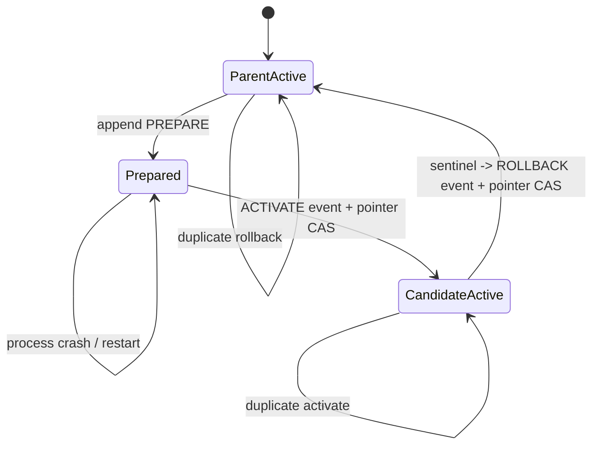

# Evaluation Gate L1 — 晋升不是改一个指针，而是一笔可恢复事务

> **核心问题**：gate 已经输出 `PROMOTE`，进程恰好崩溃、请求重复到达或线上 sentinel 随后退化时，
> 怎样保证 candidate 至多激活一次，并能切回决策中固定的 parent？
> **先修**：[L0](tutorial_L0.md) 的 paired evidence、`PromotionRecord` 与 rollback target。
> **不变量**：原始 evidence、snapshot、decision、event 只追加；唯一可变对象是可由事件重建的 active pointer。
> **运行**：`python3 L1_durable_promotion.py`；Python 标准库 + 同目录 L0 模块，CPU，通常两秒内。
> **验收**：13/13 self-check；PREPARE 后退出不切模型，恢复只 ACTIVATE 一次，stale parent 拒绝，
> sentinel 回滚后历史仍在。
> **边界**：这里是真 SQLite 事务，但 active pointer 仍是本地 serving-route 的替身，不是跨服务发布系统。

---

## 1. L0 做对了裁决，为什么还不够

L0 的 gate 是纯函数：

$$
R = G(E, C),
$$

其中 $E$ 是逐题 evidence，$C$ 是阈值配置，$R$ 是 `PromotionRecord`。纯函数适合复算，但没有回答三个
状态问题：

1. `PROMOTE` 写下以后，谁把 active model 从 parent 切到 candidate？
2. 切换请求超时重试时，怎样避免做两次副作用？
3. candidate 已激活、canary 随后失败时，rollback 是不是确实回到被评测的 parent？

如果部署层只执行 `active_model = candidate`，就有两个典型裂缝：数据库说成功但路由没切，或路由切了但
数据库没记住。L1 先缩小问题：把事实和 active pointer 放进同一个 SQLite authority，做出一个**本地单库
原子版本**。这不是最终生产架构，却能把正确的不变量先跑清楚。



---

## 2. 四类不可变事实，一个可变投影

脚本创建五张表：

| 表 | 保存什么 | 允许 UPDATE/DELETE 吗 |
|---|---|---|
| `snapshots` | snapshot identity、parent lineage、manifest digest | 否 |
| `evidence` | 原始 `EvalBundle` 与 `GateConfig` 的 canonical JSON | 否 |
| `decisions` | L0 的 `PromotionRecord`，并指向 raw evidence | 否 |
| `events` | `PREPARE / ACTIVATE / ROLLBACK` 事件与 hash chain | 否 |
| `control_state` | 当前 active snapshot 与 generation | 是，且只能随事件事务更新 |

前四张表用 SQLite trigger 拒绝普通 `UPDATE` 和 `DELETE`。`control_state` 是唯一物化投影：它可以变化，
但每次变化必须与对应 `ACTIVATE` 或 `ROLLBACK` 事件在**同一事务**提交。

更本质地说，active state 应当是历史的 fold：

$$
S_t = \operatorname{fold}(S_0, e_1, e_2, \ldots, e_t).
$$

保存 `control_state` 是为了快速查询，不是让它成为脱离历史的第二份真相。生产审计应能从事件重放并与当前
pointer 对账；L1 先检查事件链与 pointer 指向的 snapshot 是否存在。

---

## 3. 只保存 decision 不够：必须能回到 raw evidence

`record_id` 是 L0 对规范化 decision payload 的 hash。它能发现 decision payload 是否改变，却不能证明聚合
指标来自真实逐题结果。因此 `persist_decision` 在落盘前做三步：

1. 保存完整 `EvalBundle + GateConfig`；
2. 从这些 raw inputs 重新执行 `run_gate`；
3. 只有重算结果与待存 `PromotionRecord` 完全相同才接受。

数据库中的关系是：

```text
decision.record_id -> evidence_digest -> {bundle, config}
```

`audit_decision` 不信任已存聚合指标，而是重新反序列化逐题行与配置，再跑 gate。这里的“fresh”指从 raw
evidence 重建计算路径；它仍调用同一份 gate 实现，**不等于组织上独立的 evaluator**。真正的独立审计还要
独立进程、权限域、代码版本和 sentinel 管理。

`REJECT` 记录也会保存，但 `prepare()` 明确拒绝它。保存拒绝历史很重要：否则反复训练和挑选 candidate 时，
系统只留下赢家，selection process 会从审计视野中消失。

---

## 4. 为什么要把 PREPARE 与 ACTIVATE 分开

脚本故意在两者中间关闭数据库连接，模拟进程退出：

```text
PREPARE committed
--- process exits here ---
ACTIVATE not attempted
```

PREPARE 只声明：

- decision 是 `PROMOTE`；
- 当前 active 仍等于被评测 parent；
- parent/candidate snapshot 都存在；
- `rollback_target == parent_id`。

它**不切 active pointer**。所以重启后看到 durable PREPARE 时，系统仍安全停在 parent，可以继续审核、取消，
或调用恢复路径完成 ACTIVATE。

ACTIVATE 则把两件事放在同一 SQLite transaction：

1. append `ACTIVATE` event；
2. compare-and-swap：仅当 active 仍是 parent 时改成 candidate，并增加 generation。

如果 CAS 失败，整个 transaction 回滚，不能留下“事件说激活、pointer 没切”的半状态。

---

## 5. exactly-once 的准确说法：效果一次，不是请求只来一次

分布式调用可能重复，脚本不幻想 exactly-once delivery。它实现的是：**同一 decision 的激活效果至多一次**。

每类事件有稳定 idempotency key：

```text
prepare:<record_id>
activate:<record_id>
rollback:<record_id>
```

数据库对 key 加 `UNIQUE`。重试先查询旧事件；若存在，返回同一个 `(seq, event_hash)`，不再追加事件或移动
pointer。验收同时检查：首次与重试返回值相同，且 `ACTIVATE`/`ROLLBACK` 行数都恰好为 1。

幂等重试返回的是“这条请求过去已成功”的同一 event，不承诺 candidate 此刻仍 active：如果它后来已经
rollback，迟到的 activate 重试也不会把它重新切回来。调用方要判断当前状态，应同时读取 active pointer 与
generation，不能把旧成功响应当作实时路由查询。

这组保证依赖三个条件的合取：

$$
\text{exactly-once effect} =
\text{stable key} \land
\text{atomic event+state} \land
\text{stale-parent guard}.
$$

缺任何一个都不够。只有 key、没有原子事务，仍可能记了事件却没切状态；只有事务、没有稳定 key，重复请求
仍可能生成两个合法事务；没有 stale-parent guard，旧评测结果可以覆盖新 active model。

---

## 6. stale parent 为什么必须在部署时再检查一次

`candidate-stale` 与 robust candidate 都基于 `model-parent-v7` 评测，gate 也都给出 `PROMOTE`。robust candidate
先激活后，active 已变为 `candidate-robust`。此时再 prepare stale candidate，脚本拒绝：

```text
stale parent: active model changed after evaluation
```

这不是推翻原 gate，而是指出 decision 的前置条件已经过期。candidate-parent 比较是**相对于特定 parent 的
局部证据**；active lineage 改变后，旧 candidate 必须对新 parent 重新评测，不能把“曾经赢过 v7”解释成
“现在可以覆盖任何版本”。

失败是 fail closed：没有新增 PREPARE event，也没有静默把 `parent_id` 改成当前 active。后者会伪造一条从未
发生过的 pair comparison。

---

## 7. rollback 是一条新事实，不是删除失败

激活后，脚本注入 canary 原因：`hidden-safety canary below floor`。`rollback()` 读取原 PromotionRecord 中的
`rollback_target`，要求当前 active 恰好是该 candidate，然后在一个事务里：

1. append `ROLLBACK(candidate -> recorded parent)`；
2. CAS active pointer 回 parent。

它不删除 `PROMOTE` decision，也不删除 ACTIVATE。最终历史是：

```text
1 PREPARE  parent-v7 -> candidate-robust
2 ACTIVATE parent-v7 -> candidate-robust
3 ROLLBACK candidate-robust -> parent-v7
```

这三条同时为真：candidate 当时通过离线 gate；candidate 后来真的激活；线上 sentinel 又给出足够理由回滚。
如果为了让 dashboard 好看而删掉中间两条，系统将无法学习“什么离线证据仍不足以预测线上失败”。

---

## 8. 参考运行输出

```text
[1] stored raw evidence -> fresh gate recomputation
    decision=7534d48c13e17619 audit_match=True
    REJECT cannot prepare=True
[2] durable PREPARE, then simulated process crash
    prepare_seq=1 active_after_restart=model-parent-v7
[3] recovery activates exactly once
    active=candidate-robust activation_seq=2 retry_same=True
[4] stale parent fails closed
    stale_candidate_prepared=False events_unchanged=True
[5] post-activation sentinel executes rollback
    active=model-parent-v7 rollback_seq=3 retry_same=True
[6] structural self-check
    PASS | raw evidence recomputes the same decision
    PASS | REJECT decision cannot enter deployment
    PASS | crash after PREPARE leaves parent active
    PASS | recovery activates candidate
    PASS | activation retry is exactly-once
    PASS | stale parent fails closed
    PASS | stale attempt appends no PREPARE
    PASS | rollback returns to recorded parent
    PASS | rollback retry is idempotent
    PASS | promotion history survives rollback
    PASS | immutable table rejects UPDATE
    PASS | event hash chain verifies
    PASS | active pointer names a registered snapshot
SELF-CHECK: 13/13 PASS
takeaway: promotion is an append-only, recoverable state transition; rollback is a new fact, not erased history.
```

输出不打印临时目录、时间或机器信息；同一代码快照上应稳定。真正需要关注的不是 `seq=1/2/3`，而是三处
状态断言：崩溃后仍是 parent、恢复时确实到过 candidate、rollback 后回到记录中的 parent。

---

## 9. hash chain 和 append-only trigger 能防什么

每个 event hash 覆盖 canonical payload 与上一条 hash：

$$
h_t = H(h_{t-1} \parallel \operatorname{canonical}(e_t)).
$$

删除、改写或重排中间事件会让后续验证失败。SQLite trigger 同时拒绝对 snapshots/evidence/decisions/events 的
普通 UPDATE/DELETE。这对捕捉应用 bug、误操作和未授权常规写入很有用。

但它不是强对手下的 WORM 存储：拥有数据库与代码管理权限的人可以删 trigger、重写整条链并重算 hash。
生产系统还需把链头/批次摘要锚定到独立审计域或不可变对象存储，并分离训练、评测、审批和发布权限。

同理，`PRAGMA journal_mode=WAL` 与 SQLite transaction 证明的是本地数据库语义，不自动证明磁盘不会损坏、
远程副本达成 consensus，或外部 serving router 与数据库拥有共同事务。

---

## 10. 费曼自检：机场换跑道

把 parent 想成当前开放的旧跑道，candidate 是新跑道：

- gate 报告说新跑道通过检测，只是一张**批准单**；
- PREPARE 是确认新旧跑道都存在、救援路线明确，但还没有改航班；
- ACTIVATE 才是一次性把指示牌切到新跑道；
- 指示牌请求重复送达，不能反复切换或增加多个“已激活”记录；
- 运行监测发现异常时，ROLLBACK 按批准单里写死的旧跑道切回，同时保留事故全过程。

如果你的解释把 PREPARE 说成“已经换跑道”，或把 rollback 说成“删除换跑道记录”，说明事务边界还没讲清。

---

## 11. 动手改造与反例

1. 把 `store.close()` 移到 ACTIVATE 之后，模拟“激活已提交、响应丢失”。确认重试仍返回同一 activation event。
2. 去掉 `events.idempotency_key UNIQUE`，让同一 record 重试两次。观察事件数为何不再能证明 exactly-once effect。
3. 注释 stale-parent 检查，让两个基于 v7 的 candidate 连续激活。解释第二次为何没有 candidate-vs-current 的证据。
4. 在 ACTIVATE event append 后、pointer UPDATE 前抛异常。确认 transaction 回滚后两者都不存在；若只剩一边，
   说明你破坏了原子边界。
5. 增加 `CANCEL_PREPARE`：当新证据使 decision 失效时，append 取消事件而不是删除 PREPARE。

反例问题：如果 active pointer 是另一个服务的流量路由，而 event store 在 SQLite，为什么本节事务不再覆盖两边？
下一步需要 outbox/lease、发布 generation、服务端幂等、对账与补偿；不是把 `with conn:` 换成更大的 try/except。

---

## 12. 本级没有证明什么，下一层补什么

- **没有真实 blind eval**：仍使用 L0 synthetic rows，hidden split 在源码中可见。
- **没有独立 evaluator authority**：fresh audit 重用同一 gate 实现，只证明 raw evidence 可重算。
- **没有跨服务 exactly-once**：active pointer 与 event 在同一 SQLite；真实 router 是外部副作用。
- **本级没有 evaluator drift 控制**：这里只记录 evaluator version；
  [L2](tutorial_L2.md) 才加入 anchor suite、显式 re-baseline 与 epoch evidence invalidation。
- **本级没有 sequential/multiple-testing 控制**：
  [L2](tutorial_L2.md) 用 exact paired sign-flip 与 alpha-spending 给出最小可运行版本。
- **没有真实 serving SLO**：没有模型加载、GPU canary、延迟、吞吐或成本测量。

因此下一步先读 L2：把 evaluator version 变成受治理 epoch，加入 anchor drift、显式 re-baseline 与连续试验
error budget。跨进程 lease/outbox 不与统计治理挤在同一级，留给 L3 连同真实模型盲测、多阶段 canary、
人工审批、GPU serving SLO 和 evaluator succession。

一句话验收：**离线 PROMOTE 只是批准事实；安全晋升还必须把它变成可恢复、幂等、血缘不陈旧的状态转移，
而 rollback 必须新增证据，不能擦掉失败。**
