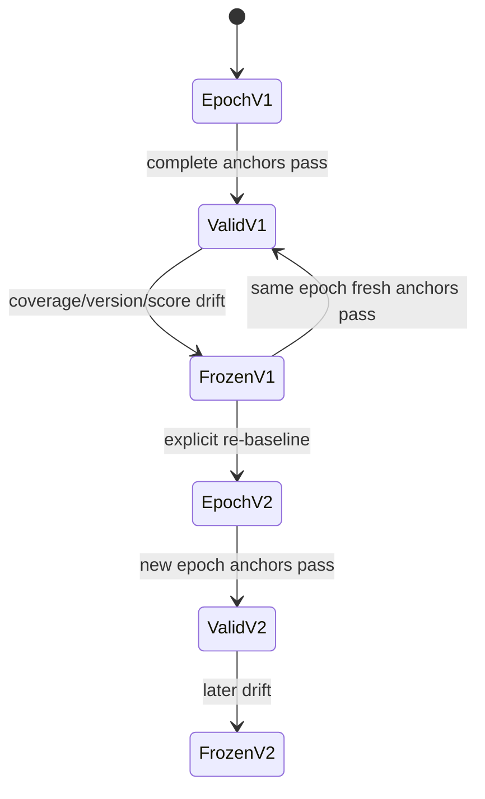

# Evaluation Gate L2 — 当尺子会漂移，晋升证据怎样继续有效

> **核心问题**：candidate 连续产生、evaluator 也会升级或漂移时，怎样避免用已经变形的尺子裁决，
> 又怎样避免“每次都按 0.05 检验”积累出越来越高的误晋升概率？
> **先修**：[L0](tutorial_L0.md) 的 paired evidence 与 hidden sentinel；
> [L1](tutorial_L1.md) 的 append-only decision、epoch lineage 与 crash-safe promotion。
> **不变量**：candidate evidence 先按独立 cluster 聚合，再做晋升检验；它只在其 evaluator epoch 内有效；
> re-baseline 新增 epoch、不改旧基线，全部 candidate trial 共用一个不会因换 evaluator 而重置的 alpha 预算。
> **运行**：`python3 L2_evaluator_governance.py`；Python 标准库、CPU，通常一秒内。
> **验收**：24/24 self-check；12 个 task 只来自 2 个 source cluster 时，逐 task 的 `p=0.019287`
> 被 cluster-level `p=0.25` 否决；独立的 marginal evidence 再被 alpha-spending 拒绝；fresh 强候选在 trial 4 晋升。
> **边界**：这是 evaluator governance toy，不是真实盲测、权限系统、在线 FDR 或评测器正确性证明。

---

## 1. L1 固定了记录，却还没有固定“尺子”

L1 能回答：某个 decision 来自哪份 raw evidence，激活是否恰好执行一次，rollback 是否保留历史。
但即使记录完全不可篡改，下面两条 decision 仍可能不可比较：

```text
candidate-A -- judge-v1 / anchor-v1 --> PROMOTE
candidate-B -- judge-v2 / anchor-v2 --> PROMOTE
```

`PROMOTE` 是相对于一套评测语义的局部结论，不是脱离 evaluator 的绝对属性。judge prompt、模型版本、
解析器、tool environment 或安全规则改变，都可能让同一个模型的分数变化。若系统只更新
`evaluator_version="v2"`，却继续沿用 v1 的阈值和旧 candidate evidence，相当于换了温标后仍把旧刻度当同一单位。

L2 因而把证据坐标写成：

$$
E = (\text{candidate},\text{parent},\text{evaluator epoch},\text{paired rows}).
$$

其中 epoch 不只是一个版本字符串，还绑定 evaluator version、anchor suite、anchor baseline、critical floors
和来源 epoch。只要 epoch 变化，旧 evidence 就陈旧；不能靠“分数看起来差不多”跨 epoch 搬运。



---

## 2. Anchor 不是普通 benchmark，而是尺子的校准块

脚本的每个 `AnchorCase` 保存：

- 稳定 `task_id`；
- epoch 建立时的 `baseline_score`；
- 不允许静默越过的 `critical_floor`。

当前 evaluator 重跑全部 anchors，得到 $s_i'$；baseline 是 $s_i$。toy 计算三项操作性指标：

$$
\operatorname{MAD}=\frac{1}{m}\sum_{i=1}^{m}|s_i'-s_i|,
\qquad
\operatorname{MaxD}=\max_i |s_i'-s_i|,
$$

以及 critical floor 两侧发生翻转的 task 数。默认规则是 `MAD <= 0.03`、`MaxD <= 0.08`、零翻转。
三个量分别捕捉整体刻度移动、单点大漂移和直接改变 pass/fail 语义的漂移。

但**先检查 identity 和 coverage，再算均值**。少跑一个困难 anchor 会让均值看起来更稳定；把缺失行静默跳过
等于允许 evaluator 自选考题。因此以下任一情况都写入 `FREEZE`：

- evaluator version 与 active epoch 不同；
- suite id 改变；
- task id 重复或覆盖不完整；
- score 越界；
- 任一漂移阈值失败。

`FREEZE` 的含义不是“新 evaluator 一定坏了”，而是**当前没有权力继续 promotion**。一次完整、同 epoch、
重新通过的 anchor check 可以从临时采集故障恢复；version 或语义真的改变时，则应走显式 re-baseline。

Anchor 的阈值只是报警器。三个 synthetic task 全绿，不能证明 evaluator 没有偏见、没被污染、没有新盲区；
它只证明这三个预先固定的校准块没有超过约定漂移界限。

---

## 3. 为什么连续试 candidate 不能每次都用 0.05

假设每个实际无增益的 candidate 都做一次 level-$\alpha$ 检验，而且不同试验近似独立。连续试 $T$ 次，
至少误报一次的概率是：

$$
P(\text{at least one false promotion}) = 1-(1-\alpha)^T.
$$

当 $\alpha=0.05,T=20$ 时，这个量约为 $64.2\%$。这不表示每个 p-value 算错了；错在把二十次局部保证
误读成一个全程保证。更糟的是，真实研发会根据上轮失败适配 candidate，试验也未必独立。

L2 用一个最容易审计的 alpha-spending schedule：

$$
\alpha_t=\frac{\alpha_{\mathrm{total}}}{t(t+1)}.
$$

因为

$$
\frac{1}{t(t+1)}=\frac{1}{t}-\frac{1}{t+1},
$$

所以级数望远镜相消：

$$
\sum_{t=1}^{\infty}\alpha_t=\alpha_{\mathrm{total}}.
$$

使用 union bound，只要每次检验在当时的设计下确实满足
$P(\text{false reject at }t)\le\alpha_t$，全程误晋升概率就不超过总预算。它不要求各次独立，代价是后面的
阈值越来越严格。

代码中的具体数值（gate 使用 `cluster p`，`task p` 只诊断伪重复）：

| trial | 设计 | task p | cluster p | 固定 0.05 | spending threshold | 最终 |
|---:|---|---:|---:|---:|---:|---|
| 1 | 12 个独立 cluster，正负各半 | 0.612793 | 0.612793 | 不过 | 0.025000 | REJECT |
| 2 | 12 task、仅 2 个 source cluster | 0.019287 | 0.250000 | 不过 | 0.008333 | REJECT |
| 3 | 12 个独立 cluster，10 正 2 负 | 0.019287 | 0.019287 | **会过** | 0.004167 | REJECT |
| 4 | 9 个独立 cluster，全正 | — | 0.001953 | 会过 | 0.002500 | PROMOTE |

trial 2 先说明“task 多”不等于“独立证据多”；trial 3 再说明 `p < 0.05` 仍不足以推出“在这条持续搜索
lineage 上还能晋升”。这是两个不同错误，不能指望只靠其中一道 gate 同时解决。

---

## 4. p-value 从哪里来：独立单位是 cluster，不是 row

每个 candidate 仍与特定 parent 在同一批任务上配对，差值为 $d_i=c_i-p_i$。零假设下，若差值分布关于零
对称，符号向量应可交换。脚本枚举 $2^n$ 种符号：

$$
p=\frac{\#\left\{\boldsymbol\sigma\in\{-1,+1\}^n:
\sum_i\sigma_i d_i\ge\sum_i d_i\right\}}{2^n}.
$$

toy 限制 $n\le20$，所以可以精确枚举，不引入 Monte Carlo seed。若 12 个 task 真是 12 次独立抽样，10 个
`+0.01`、2 个 `-0.01`；达到或超过观察统计量需要至少 10 个正号，因此：

$$
p=\frac{\binom{12}{10}+\binom{12}{11}+\binom{12}{12}}{2^{12}}
=\frac{79}{4096}\approx0.019287.
$$

但 demo 的伪重复 candidate 中，前 6 行来自 `source-a`，后 6 行来自 `source-b`。同一 source 派生题共享文本、
生成器和标注偏差，不能把每行符号当成独立硬币。代码先按预登记的 `cluster_id` 求簇内均值：

$$
\bar d_g=\frac{1}{|I_g|}\sum_{i\in I_g}d_i,
\qquad g=1,\ldots,G,
$$

再对 $G$ 个 cluster mean 枚举符号。两个 cluster mean 都为正，4 种符号组合中只有全正达到观察统计量，因此
$p=1/4=0.25$。逐 task 的 `0.019287` 仍写入 decision 作为诊断，但**不驱动 promotion**。

这里 equal-weight cluster mean 明确改变了估计目标：每个 source 权重相同，不是每个 task 权重相同。若产品目标
本来就是“随机一条请求”的平均效果，就需预先定义 cluster 抽样与权重，不能看到结果后挑更有利的口径。
`cluster_id` 也必须来自数据谱系，而不是模型自己猜；缺失、空值或与 delta 数量不一致都在领取 trial number
之前 fail closed。

这项精确性只是**给定假设下的计算精确**。cluster 之间若仍相关、cluster mean 不满足零假设下的符号对称、
candidate 根据同一批逐题反馈适配，p-value 仍可能无效；alpha-spending 无法把无效 p-value 变有效。生产设计
应按真正的独立抽样单元置换/重采样，并把 cluster 定义、权重、adaptive selection、数据复用和 stopping rule
一起预先规定。

---

## 5. 漂移为什么先冻结，而不是立刻“校准一下”

demo 在三个 candidate trial 后，把 evaluator 从 `judge-v1` 换成 `judge-v2`。同一 anchor task 的平均绝对变化
是 `0.047`，超过 `0.03`；version 也不同。ledger 先 append `FREEZE`，随后任何 candidate submission 都在
分配 trial number、计算 p-value之前失败。

这个顺序有两个作用：

1. evaluator 不合法时不产生一个看似正式的 candidate decision；
2. 无效请求不消耗 alpha，审计可以区分“第几次被正式检验”和“第几次请求到达”。

系统也不能自动把当前输出写成新 baseline。否则 evaluator 每次缓慢退化，baseline 就跟着移动，anchor 会从
报警器变成漂移的追随者。re-baseline 必须是一条显式事件，且旧 epoch 永久保留。

---

## 6. Re-baseline 是建立新坐标系，不是改旧刻度

`rebaseline()` 在一个 SQLite transaction 中：

1. 要求 active epoch 最新状态已 `FREEZE`；
2. 要求两个不同的 approval id 和实质理由；
3. 在这个 toy 中要求 task coverage 与 critical floors 不变；
4. 拒绝把低于 critical floor 的当前分数写成“新正常”；
5. append 新 `evaluator_epoch` 与 `REBASELINE` record；
6. 将 active epoch 指向新 epoch，但**不重置** global trial counter。

最后一点防止“换 evaluator 洗 alpha”：如果 v1 已试三个 candidate，v2 的第一个正式 candidate 仍是 trial 4，
阈值为 $0.05/(4\times5)=0.0025$。若每次 re-baseline 都从 trial 1 重来，系统可以通过频繁换 epoch 获得无限个
`0.025`。

同样，epoch v1 的旧 evidence 不会因为 v2 已通过 anchors 而恢复有效。candidate 必须在 v2 下 fresh 评测；
这不是说旧结果毫无信息，而是说它没有直接驱动 v2 promotion 的权限。

toy 中的 `review-a` / `review-b` 只是两段不同字符串。它演示的是**审批数据合同**，不证明两个人、两个进程或
两个权限域真的独立。生产系统必须在身份系统与访问控制层兑现 separation of duties。

---

## 7. 为什么仍要 append-only ledger

L2 的 SQLite 保存五类不可变事实：

| 表 | 作用 |
|---|---|
| `evaluator_epochs` | version、suite、baseline、critical floors、parent epoch |
| `drift_reports` | 每次完整或失败的 anchor observation |
| `candidate_trials` | paired deltas、cluster ids、task/cluster p-value、trial number、当次 alpha 与 decision |
| `rebaselines` | source freeze、理由、approval ids、新旧 epoch |
| `governance_events` | 所有治理动作的 hash chain |

这些表的 UPDATE/DELETE 被 trigger 拒绝。唯一可变的 `control_state` 保存 active epoch 与 next trial number；它是
事件的物化投影，不是可改写历史。re-baseline 后查询数据库会同时看到 v1 和 v2，而不是只剩“当前正确版本”。

hash chain 仍只防常规误操作和局部篡改：拥有数据库与程序控制权的人能删 trigger、重算全链。生产审计需要把
链头或批次摘要外锚到独立权限域。这个边界与 [L1](tutorial_L1.md#9-hash-chain-和-append-only-trigger-能防什么)
相同。

---

## 8. 参考运行输出

```text
[1] anchor coverage is a fail-closed precondition
    stable=VALID missing=FREEZE recovered=VALID
[2] task replication is not independent evidence
    trial=1 clusters=12 p_cluster=0.612793 alpha=0.025000 decision=REJECT
    trial=2 tasks=12 clusters=2 p_task=0.019287 p_cluster=0.250000 decision=REJECT
[3] cluster-valid trials still share one alpha budget
    trial=3 p_cluster=0.019287 naive_0.05=True alpha=0.004167 decision=REJECT
[4] evaluator drift freezes admission
    status=FREEZE mean_abs=0.047 frozen_attempt_rejected=True
[5] explicit re-baseline creates a new evidence epoch
    epochs=2 duplicate_approval_rejected=True old_evidence_rejected=True
[6] fresh evidence resumes under the global trial counter
    trial=4 clusters=9 p_cluster=0.001953 alpha=0.002500 decision=PROMOTE
[7] structural self-check
    PASS | stable anchors validate the evaluator
    PASS | missing anchor coverage freezes promotion
    PASS | a complete fresh check can recover
    PASS | null-like first candidate is rejected
    PASS | pseudo-replicated tasks look significant if treated as independent
    PASS | two source clusters provide only p=0.25 evidence
    PASS | cluster-aware gate rejects pseudo-replication
    PASS | independent marginal evidence passes naive cluster alpha
    PASS | trial-3 alpha spending rejects independent marginal evidence
    PASS | invalid cluster metadata is fail-closed before spending
    PASS | the infinite-style alpha schedule stays within budget
    PASS | evaluator version drift freezes promotion
    PASS | a frozen attempt neither admits nor spends a trial
    PASS | duplicate approval ids cannot re-baseline
    PASS | re-baseline cannot normalize a critical failure
    PASS | old and new evaluator epochs both remain
    PASS | old-epoch candidate evidence is stale
    PASS | new epoch must pass its own anchors
    PASS | fresh strong evidence contains nine independent clusters
    PASS | strong fresh evidence passes the trial-4 threshold
    PASS | only four admitted trials consumed alpha
    PASS | immutable evaluator facts reject UPDATE
    PASS | governance event hash chain verifies
    PASS | mutable control state matches event replay
SELF-CHECK: 24/24 PASS
takeaway: clusters define independent evidence; evaluator change freezes promotion; neither replication nor re-baselining resets the error budget.
```

输出不含临时路径、时间和机器信息。关键不是背下四个 p-value，而是能解释四条边界：为什么 12 个 row 可能只有
2 个独立证据单位；缺 anchor 为什么冻结；换 evaluator 后旧 evidence 为什么失效；为什么新 epoch 的第一个
candidate 仍是全局 trial 4。

---

## 9. 费曼自检：实验室换温度计

把 evaluator 想成温度计，anchors 是冰点、沸点和一个安全临界样本：

- 每次测新材料前先测校准点；少测一个不能说校准通过；
- 温度计型号或刻度明显变化，先暂停“材料合格”裁决；
- re-baseline 是保留旧校准记录后建立新刻度，不是在旧表格上覆盖数字；
- 旧温度计测过的材料不能直接拿新刻度作合格证；
- 同一批原料切成 6 小块，不会自动变成 6 批独立原料；
- 连续试很多材料时，不能每次都假装这是实验室唯一一次误报机会。

如果你的解释说“新温度计均值更高，所以材料更好”，就把测量系统和被测对象混在了一起。

---

## 10. 动手改造与反例

1. 删除 `format` observation，确认没有漂移均值可供“部分通过”，只有 coverage freeze。
2. 把 `judge-v2` anchor 中 `safety` 降到 `0.79`，确认 re-baseline 拒绝把 critical failure 正常化。
3. 在 re-baseline 时把 `next_trial` 重置为 1，连续换 20 次 epoch；计算系统实际获得了多少额外 alpha。
4. 保持 trial 2 的数据不变，比较“每个 source 等权”和“每个 task 等权”的效应量；说明两者各自回答什么问题，
   以及为什么权重必须在看结果前确定。
5. 让同一 candidate evidence 重复提交。观察 `evidence_id` 唯一约束为何拒绝把重试当成新试验；再设计一个
   明确的 “collect more fresh tasks” evidence identity。
6. 故意把两个相关 source 标成 12 个 cluster。说明为什么代码无法从字符串唯一性证明统计独立性，并设计一项
   基于数据 lineage 的 cluster-id 审计。

反例问题：如果 candidate 生成器已经看过所有 anchor 的逐题结果，anchor 仍然稳定能否证明 evaluator 没被
Goodhart？不能。稳定只说明已知 anchors 没变，不能排除 candidate 对 anchors 过拟合；还要隔离 hidden
sentinels、轮换任务、设置污染检测与独立审计。

---

## 11. 本级证明了什么，仍缺什么

L2 通过可运行反例证明了五个控制流不变量：

- promotion 使用预登记 cluster 的等权均值；逐 task 显著但 cluster 不显著时 fail closed；
- evaluator identity/coverage/anchor drift 失败时 promotion fail closed；
- re-baseline 新增 epoch，旧 baseline 与旧 evidence 不被改写；
- global alpha budget 不因 evaluator 换代而重置；
- candidate trial、drift 与 re-baseline 都进入 append-only lineage。

它没有证明：

- anchors 足以代表真实目标，或 evaluator 没有系统偏差；
- synthetic visible anchors 具有真实保密性；
- cluster id 真实表达独立采样单元，或 cluster-level sign-flip 假设成立；
- equal-weight cluster estimand 与真实产品流量目标一致；
- alpha-spending 解决了数据复用、adaptive p-hacking 或功效分配的最优性；
- approval ids 对应真实独立审批；
- 外部 router、GPU serving、canary 与 ledger 跨服务原子一致。

下一层应把两类问题分开：先用 outbox/lease/generation 把外部 router 发布做成可对账的状态机；再用真实模型、
隔离盲集与 GPU canary 测 latency/throughput/error/quality SLO。不要用一条吞吐数字代替 evaluator succession，
也不要用统计显著代替线上可靠性。

一句话验收：**先找对独立证据单位，再谈显著性；评测器这个坐标系漂移就冻结、换坐标系就重评，而试过多少
candidate 的误报预算必须沿 lineage 继续累计。**
