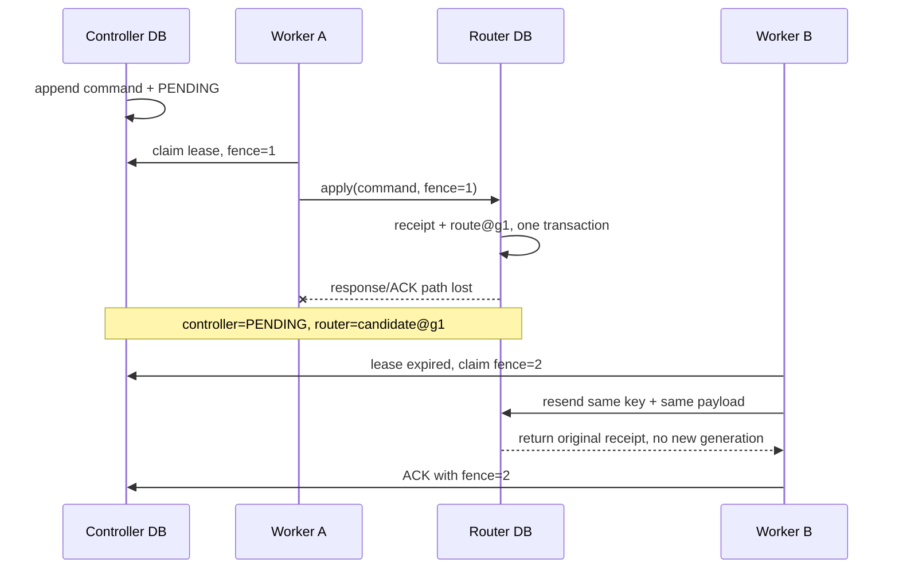

# Evaluation Gate L3a — 数据库批准了，外部 router 真的切了吗？

> **核心问题**：promotion ledger 与 serving router 不在同一个事务域时，怎样处理“router 已切换、controller
> 的 ACK 却丢失”，并阻止重复切换、陈旧 worker 和陈旧 generation 覆盖当前路由？
> **先修**：[L1](tutorial_L1.md) 的 PREPARE/ACTIVATE/rollback 与
> [L2](tutorial_L2.md) 的 evaluator epoch、re-baseline 和全局 error budget。
> **不变量**：route command 只追加；idempotency key 绑定完整 payload；router 以 generation/from-model 做 CAS；
> controller 只能用匹配的 durable receipt 推进投影；未知分歧冻结，不能猜。
> **运行**：`python3 L3_external_router.py`；纯标准库、CPU、固定逻辑时钟，通常一秒内。
> **验收**：21/21 self-check；丢 ACK 后重试只有一次路由效果，rollback receipt 可由 reconcile 补记，
> out-of-band route 会冻结后续发布。
> **边界**：两个 SQLite 文件是真实独立事务域，但不是网络服务、共识协议或真实 GPU serving。

---

## 1. L1 的原子性为什么出了数据库就消失

L1 把 `ACTIVATE event` 与 `active_model` 放在同一个 SQLite transaction 中，因此两者要么同时提交，要么同时
回滚。真实 serving router 往往是另一个服务：controller 的数据库不能把 router API 纳入自己的 ACID transaction。

最危险的窗口不是请求明确失败，而是结果**不确定**：

```text
controller: durable outbox command committed
router:     route parent@g0 -> candidate@g1 committed
network:    response lost
controller: still PENDING
```

此时三种直觉都不可靠：

- “本地还是 PENDING，所以 router 一定没切”——错；
- “再发一次总能修好”——若下游不幂等，可能切两次或覆盖更新；
- “标成成功就行”——没有 receipt，可能把从未发生的副作用伪装成事实。

L3a 把裂缝保留下来，用协议恢复，而不是用一个横跨两库的 Python `try/except` 假装原子。



---

## 2. 两个 authority，各自只拥有一部分真相

脚本创建两个不同 SQLite 文件：

| authority | 拥有什么 | 不应声称拥有什么 |
|---|---|---|
| controller | approved route command、delivery lease、ACK、期望 route 投影 | router 此刻真的指向哪里 |
| router | active model、generation、已应用命令的 receipt | candidate 是否通过 evaluator gate |

controller 的 route command 来自上游已批准 decision，字段包括：

```text
decision_id, kind, from_model, to_model, expected_generation,
idempotency_key, payload_hash, command_id
```

router 不重新判断 candidate 质量；它只判断这条发布命令是否与当前路由状态相容。evaluation authority 和
publication authority 因而没有混成一个万能服务。

---

## 3. Outbox 解决“命令有没有落盘”，不解决“副作用有没有发生”

`enqueue()` 在 controller 单库事务里同时：

1. append immutable `commands` row；
2. 建立 `delivery_state=PENDING`；
3. append `ENQUEUE` event。

所以进程在 worker 取走前崩溃，命令不会丢。但 outbox commit 只证明**应该尝试发布**，不证明 router 已应用。
worker 必须把 router 的 durable receipt 送回 controller，后者才能把 expected route 从 parent@g0 推进到
candidate@g1。

这个 toy 一次只允许一个 unresolved route command。它不是吞吐限制的最佳实践，而是先固定线性 publication
lineage：如果前一个 candidate 是否生效尚未知，就不应继续发一个基于不确定 parent 的新命令。生产系统可以按
tenant/model stream 分区并行，但每个 stream 仍需有序 generation。

---

## 4. Idempotency key 必须绑定命令 payload

脚本使用：

$$
k=\texttt{kind:decision\_id},
$$

并保存：

$$
h=H(k,\text{decision},\text{kind},\text{from},\text{to},\text{expected generation}).
$$

router 的 `receipts` 以 key 唯一索引：

- 同 key、同 hash：返回第一次的同一 receipt，不再移动路由；
- 同 key、不同 hash：立即拒绝 identity collision；
- 新 key：还必须通过 generation/from-model CAS。

router 会从 command 字段重新计算 key、hash 与 command id，不信任调用方自带的 `payload_hash`；否则攻击者只需
把 payload 和 hash 一起伪造，所谓“hash 绑定”就退化成客户端自我声明。

这比“看到同 key 就返回成功”多一个关键约束。否则第一次是 `parent -> candidate-A`，攻击者或 bug 用同 key 改成
`parent -> candidate-B`，系统可能把 A 的 receipt 错认成 B 已部署。

Idempotency 只约束**同一业务命令**。两个不同 key 仍可能冲突，因此还需要 generation guard。

---

## 5. Generation CAS 防的是陈旧 publication

router 接受新命令的前置条件是：

$$
(\text{active model},\text{generation})
=(\text{command.from model},\text{command.expected generation}).
$$

成功后在 router 自己的一个事务中：

1. append payload-bound receipt；
2. append `APPLY` event；
3. CAS route 到 `to_model@g+1`。

demo 在 candidate 已经是 g1 后，直接向 router 发送一条仍基于 `parent@g0` 的新命令。即使 key 从未使用，router
也拒绝。这是 publication 侧的 stale-parent guard：旧 evaluation 或旧 worker 不能覆盖已经演进的 active lineage。

Generation 不是时间戳。它表示这个 route stream 已成功提交多少次受序状态转换，避免依赖不同机器的 wall clock
比较先后。

---

## 6. Lease 与 fencing token：准确保证到哪一层

controller worker claim 使用固定逻辑时钟：

```text
worker-a: now=10, ttl=5 -> token=1, expires at 15
worker-b: now=12        -> rejected, lease is active
worker-b: now=16        -> token=2, claim succeeds
```

token 单调增加。controller ACK 要同时匹配 `worker_id + token + lease_until`，所以 worker A 在 token 2 已发出后
不能用旧 token 写入 ACK。这个 toy 的 token **fence 的是 controller delivery projection**。

router 同时记录收到的 token用于审计，但真正保护 route 的是 payload idempotency 与 generation CAS；它没有外部
lease registry，不能仅凭一个数字知道“某个更高 token 已在 controller 发出”。若生产系统要求撤销旧 worker 对
下游的写权限，router 必须持久保存并校验 stream-level fence/lease epoch，或由具备 fencing 的队列/存储签发。

因此不要写出这个常见但错误的等式：

$$
\text{lease token exists} \not\Rightarrow \text{downstream side effect is fenced}.
$$

---

## 7. 两种 lost-ACK 恢复路径

### 7.1 安全重发

ACTIVATE 场景中，worker A 在 router commit 后退出。lease 过期后 worker B 取得 token 2，发送完全相同的 command。
router 查到相同 key/hash，返回原 receipt；generation 仍是 1。worker B 再以当前 token ACK controller。

### 7.2 Receipt reconcile

ROLLBACK 场景中，router 已从 candidate@g1 切回 parent@g2，但 controller 再次没收到 ACK。reconciler 不先猜，
而按 pending command 的 idempotency key 查询 router：

- 找到且 payload、from/to、generation 全匹配：append `RECONCILE_ACK`，推进 controller projection；
- 查不到：维持 PENDING；不能把 absence 当成“肯定没执行”；
- receipt 冲突或 controller lineage 已改变：冻结并请求审计，不自动覆盖。

reconcile 的本质是用下游 durable evidence 补齐上游事实，而不是“定时把两边值强行设成一样”。

---

## 8. 对账发现 unexpected drift 时为什么不自动修

demo 用 router 自己的 auditable `ADMIN_OVERRIDE` 把 parent@g2 改成 `rogue-model@g3`。controller 不存在对应
command/receipt，所以两边 projection 不一致：

```text
controller expects parent@g2
router reports   rogue-model@g3
```

reconciler append `ROUTER_DRIFT` 并设置 `frozen=1`；新的 enqueue 被拒绝。它没有自动发
`rogue-model -> parent`，因为尚不知道 override 是否来自合法 break-glass 操作、事故处置或入侵。自动覆盖可能
撤销正在救火的人工动作，也可能基于错误 parent 再次破坏路由。

正确恢复需要独立审计 route event、ticket、当前健康状态与 upstream decision，再显式产生新的 repair/compensation
command。repair 本身仍要新 key、新 generation 与审批，不能修改旧历史。

---

## 9. Append-only facts 与可重放投影

controller 的 `commands/controller_events` 与 router 的 `receipts/router_events` 拒绝 UPDATE/DELETE；
`delivery_state/control_state/router_state` 是可变投影。两边各自维护 hash chain：

$$
h_t=H(h_{t-1},\operatorname{canonical}(e_t)).
$$

self-check 不只验证 hash，还从事件重放：

- controller 的 expected model/generation/frozen，以及每条 delivery 的 lease/status/receipt；
- router 的 active model/generation，以及 APPLY event 数是否等于 receipt 数。

这样能捕捉“事件说 ACK 了，但 mutable pointer 没推进”等应用错误。它仍不是强对手下的 WORM：能控制数据库和代码的
人可以重写全链。生产系统需把摘要外锚、分离权限并保留独立 router/controller audit。

---

## 10. 参考运行输出

```text
[1] outbox delivery crosses two durable authorities
    router_after_crash=candidate-robust@g1 controller_pending=True
[2] lease expiry and idempotent retry close the lost-ack gap
    fence=1->2 same_receipt=True router_generation=1
[3] payload and generation guards reject stale publication
    payload_collision_rejected=True forged_hash_rejected=True stale_generation_rejected=True
[4] reconcile recovers a committed rollback with a lost ack
    recovered=1 controller=model-parent-v7@g2
[5] unexpected router drift freezes new publication
    router=rogue-model@g3 frozen=True
[6] structural self-check
    PASS | controller and router use separate durable authorities
    PASS | router committed while controller still awaited an ack
    PASS | an unexpired lease cannot be stolen
    PASS | lease expiry issues a higher fencing token
    PASS | retry returns the original payload-bound receipt
    PASS | activation retry does not increment router generation
    PASS | a stale worker token cannot acknowledge
    PASS | same key with a changed payload fails closed
    PASS | router recomputes command identity instead of trusting its hash
    PASS | router rejects a stale generation/from-model command
    PASS | reconcile recovered the lost rollback acknowledgement
    PASS | reconciled controller and router projections agree
    PASS | rollback retry returns one receipt and one effect
    PASS | out-of-band route drift freezes publication
    PASS | frozen publication rejects a new command
    PASS | controller commands reject mutation
    PASS | router receipts reject deletion
    PASS | controller event hash chain verifies
    PASS | router event hash chain verifies
    PASS | controller projection matches event replay
    PASS | router projection matches event replay
SELF-CHECK: 21/21 PASS
takeaway: an outbox does not create cross-service ACID; stable keys, generation guards, durable receipts, and reconciliation make gaps auditable.
```

输出不含真实路径、wall clock 或机器信息。验收重点不是记表名，而是能指出 lost-ACK 时两边分别有哪些 durable fact，
以及哪些状态可以自动恢复、哪些必须冻结。

---

## 11. 费曼自检：仓库与高速公路指示牌

把 controller 想成仓库里的“换指示牌批准单”，router 是高速公路上的真实电子牌：

- 批准单入库，不等于公路牌已切；
- 维修工切完牌但无线电断了，仓库不能断言失败；
- 同一工单号再送达，公路控制器应返回原回执，不能再切一次；
- 如果牌已经经历 g1，拿着基于 g0 的旧工单不能覆盖；
- 仓库发现公路牌被应急人员改过，应暂停新工单并查应急票据，而不是自动抢回。

如果你的解释把 outbox 说成“保证外部动作 exactly once”，说明仍把命令持久化与副作用提交混在了一起。

---

## 12. 动手改造与反例

1. 去掉 router 的 `idempotency_key PRIMARY KEY`，在 ACK 丢失后重发。检查 generation 和 receipt 数怎样失真。
2. 保留 key 唯一，但删掉 payload hash 比较；用同 key 把 candidate 改掉，解释为何旧 receipt 变成错误证明。
3. 删掉 generation/from-model CAS，先应用另一个命令，再投递旧 g0 命令。观察 active lineage 被覆盖。
4. 让 worker A 在 token 2 发出后 ACK；删掉 controller token 检查，观察陈旧 worker 怎样推进 projection。
5. 给 router 增加真正的 stream-level `max_fencing_token`。再设计“旧 token 先到、新 token 尚未同步”的反例，
   说明 fencing 服务本身也需要持久顺序来源。
6. 将单一 pending 限制改为按 `route_stream_id` 分区；证明同 stream 有序、不同 stream 可并行。

---

## 13. 本级证明了什么，还缺什么

L3a 证明了一个最小跨事务域 publication protocol 的可执行不变量：

- durable outbox 防命令丢失，但不伪称副作用已发生；
- payload-bound idempotency 让 lost-ACK 重试只产生一次 route 效果；
- generation CAS 拒绝陈旧 parent/worker 覆盖新 lineage；
- receipt reconcile 只补有确定证据的 ACK；
- 未解释的 router drift 冻结，而不是自动“修一致”；
- 两个 authority 的 immutable facts 与 mutable projections 可分别审计。

它没有实现真实 HTTP timeout、进程并发压测、跨机时钟、队列 delivery、权限服务、共识、TLS、真实 serving router，
也没有进行 blind eval 或 GPU canary。尤其不要把“20/20 toy self-check”解释成生产 deployment 已验证。

L3b 应在 GPU 网络恢复后，固定 model/data/hardware/warmup/concurrency，做真实 blind eval 与分阶段 canary，记录
quality floor、错误率、P50/P95/P99 latency、throughput、显存、cost 和 rollback time；evaluator succession 还要
独立 anchors、hidden exploit sets 与人工审批。GPU availability 不影响 L3a 的协议结论，只决定这些实测何时进行。

一句话验收：**controller 负责持久化“应该切”，router receipt 证明“确实切过”；两者不一致时靠稳定身份、
generation 与对账恢复，证据不足就冻结。**
